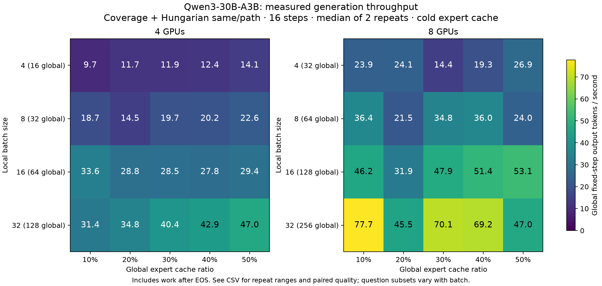

# Current-server validation — 2026-10-01 UTC

Base: `codex/mgo-v2-runtime-20261001` at
`1ded6bbf5058716db52b2299cd9b50ec50b6301e`.
Raw evidence: `/home/hwlee/mgo-results/runtime_validation_20261001` on
`cloud-0n58xq`. Compact audited evidence is checked in under
[`results/server_20261001`](results/server_20261001).

## Environment

- Eight H100 80GB GPUs, NV18 connectivity between every pair, CUDA 12.8.
- One process exposes one GPU. The OS exposes only NUMA node 0; PCI sysfs
  reports -1. Strict CPU/memory binding is applied to the sole OS node and
  verified with `get_mempolicy`. Physical locality beyond the VM's exposed
  topology cannot be inferred.
- PyTorch 2.11.0+cu128, Transformers 4.57.6, CUTLASS 3.5.1.
- NCCL reports 2.28.9+cuda12.9; the installed CUDA driver reports 12.8.
- Checkpoint: `/home/hwlee/model/Qwen3-30B-A3B-Instruct-2507`, BF16,
  48 layers, 128 experts/layer, top-8, hidden 2048, expert intermediate 768.
- Dense layers and attention run on GPU. No RPC expert path, legacy Python
  residency controller, migration or GPU expert replication is enabled.
- The overlapping `hard_affinity_gpu_validation_20261001` launcher and its
  eight workers were stopped under the user's authorization. The exact
  process receipt is `stopped_experiments.json`; existing results were kept.

## Defects fixed

1. The smoke loader entered the legacy Python model/control stack. A new
   checkpoint loader creates native HF dense GPU modules and directly loads
   only the C++ host-store/slot extension. Experts remain meta placeholders
   in HF and execute through the single `GlobalExpertController`.
2. Caller, worker and return CUDA streams lacked sufficient dependencies.
   Input/output events now cover routing snapshots, gathered inputs and
   asynchronously stored partials, including non-default caller streams.
3. Fused BF16 arithmetic and rank-first accumulation changed native Qwen3
   rounding. One diagnostic run produced 429 router-choice mismatches despite
   matching generated tokens. The default now uses native projection/SiLU
   rounding and origin-side accumulation in expert order. The return protocol
   sends real weighted expert vectors without zero-padded top-k payloads.
4. Fetching into a physical slot did not rebind the tensor index used by the
   computing module. Its old CPU views caused additional host-weight reads.
   Slot commits now install actual CUDA tensor views. Debug audits check
   addresses as well as owner/expert/slot maps. This was found by the new
   direct-view assertion and independently confirmed in the old Nsight trace.
5. Tied Coverage percentiles were assigned different ranks, and normalized
   floating-point scores could split exact ties by one ULP. Integer doubled
   midranks preserve the validated tie-break. Float32 similarity=.65 is
   inclusive; gate history matches the trace packer's mean rounding.
6. Impossible hard quotas now fail before changing cache residency, and
   affinity-based policies reject missing, malformed or nonfinite tables.
7. Resident weights are read directly from pinned execution slots. A drained,
   explicit experiment reset can resize the physical pool together with a
   fresh controller. Hungarian repeated-rank costs, exact swap deltas, bulk
   gate-history updates and token packet construction avoid redundant work.
8. Left-padded batched generation now supplies per-sequence position IDs.
   Padding rows are excluded from expert execution, policy history and traffic.
   The original dense attention mask still controls attention. CPU regressions
   cover decode refresh, empty valid inputs and detaching the root mask hook.
9. Coverage losses are updated only for changed resident layers. A randomized
   cache-mutation oracle and the 3,335-victim recorded replay preserve decisions.
   The previous full recomputation dominated preliminary controller time.
10. All-to-all and all-gather connections are warmed before the 54GiB pinned
    host expert store is allocated. A padded R4 attempt made no forward progress
    for ten minutes in UVM memory operations while another CUDA job overlapped;
    sequential execution with explicit warmup completed and passed. This does
    not isolate the driver cause. No NCCL transport workaround is assumed.

## Correctness evidence

The portable [correctness summary](results/server_20261001/correctness.json)
retains per-rank zero-error counts, source-receipt hashes, policy replays and
slot-transfer trace summaries.

| Check | Result | Receipt |
|---|---|---|
| CPU regressions | 22 passed | [test log](results/server_20261001/cpu_tests.txt) |
| R1 native full model, 10% cache | 4 prompts, 768 MoE events, zero differences | `model_r1_bound_cache10/rank0.json` |
| R4 native full model, 10% cache | 4 ranks, 768 events, zero differences | `model_r4_bound_cache10/rank*.json` |
| R8 native full model, 10% cache | 8 ranks, 1,536 events, zero differences | `model_r8_bound_cache10/rank*.json` |
| R4 padded native batch, 10% cache | 32 questions × 4 generated tokens, 768 events, zero differences | `model_r4_padded_b8_warm/rank*.json` |
| R8 slots with substitution, Coverage, swap, resize | All outputs bitwise equal to independent FFN oracle | `slots_r8_incremental/rank*.json` |
| Recorded LRU policy replay | 96 events, 4,573 evictions checked | `replay_lru.json` |
| Recorded Gate policy replay | 96 events, 4,169 evictions checked | `replay_gate.json` |
| Recorded Coverage policy replay | 96 events, 3,335 evictions checked | `replay_coverage_incremental.json` |

Full-model parity checks selected expert IDs, routing weights, every valid-token
MoE output element/checksum and all generated token IDs. Padding rows are
excluded from the padded comparison, as they are from expert execution. Four fixed prompts each produce
four tokens; this proves those cases, not arbitrary workload bitwise identity.
Every debug layer checks single-copy residency, physical tensor addresses and
physical fetch count versus logical misses. Slot fixtures also cover an empty
origin rank, an all-empty event, repeated eviction and alternate CUDA streams.

Replay takes the reference's recorded admissions to isolate substitution and
eviction. It verifies Hit/SubHit/Miss, merged gate mass, effective expert demand,
owners and each victim. It does not claim Python and the older simulator use
the same random generator or admission trajectory. Admission invariants cover
all seven policies; incremental swap decisions match a separate full-objective
recomputation over randomized cases.

## Physical transfer evidence

Nsight Systems 2024.6.2 measured the same real 9MiB-expert fixture after fixing
slot binding, using copy mode and direct-view mode. Both passed exact output
and physical slot audits. Each executes 155 experts, of which 48 require a
host fetch. The independent oracle's copies are excluded by runtime NVTX ranges.

| Mode | Actual expert H2D | Actual expert D2D | H2D/GEMM overlap |
|---|---:|---:|---:|
| Bound-slot copy baseline | 452,984,832 B | 1,462,763,520 B | 0.321 ms |
| Direct slot views | 452,984,832 B | 0 B | 0.420 ms |

H2D exactly equals logical misses × 9MiB. The old, incorrectly bound path also
showed host-to-device transfers for all three projections on every execution.
The new default eliminates that bypass and the full-expert D2D copy. Overlap
exists but is small in this fixture (4.94% of H2D time with views); this is not
a model throughput improvement claim. The controller pins active experts,
so these runs use direct fetches; the staging path is not forced by an unsafe
active-slot eviction.

Receipts: `profile_slots_bound_{copy,views}_summary.json`, corresponding
`.nsys-rep`/SQLite files, and `scripts/summarize_slot_trace.py`.
`fabric_warm_r{1,2,4,8}/rank*.json` separately records OS-local pinned H2D,
H2D+staging-D2D and NCCL all-to-all bandwidth with five samples per rank.
These are payload bandwidth measurements, excluding wire/protocol overhead.

## Full-model trace collection

The full-model diagnostic uses a separately extracted Nsight Systems
2025.6.1.190 with CUDA event-completion tracing and profiler-stop flushing
disabled. The runtime and benchmark fingerprint remains the measured
`a0be82e` version. NVIDIA documents that event-completion tracing can introduce
extra cross-stream dependencies; disabling it is a profiling setting, not a
runtime synchronization change ([Nsight guide](https://docs.nvidia.com/nsight-systems/UserGuide/#cuda-event-trace)).

The installed 2024.6.2 tool completed the small slot fixture, but two full-model
attempts stalled during the second cell; increasing the flush interval did not
resolve this. A separate single-cell attempt exited with SIGSEGV. Their logs,
interruption records and partial traces are preserved as
`model_nsight_r4{,_buffered,_lru}` and excluded from measured tables. The later
successful configuration changes both tool version and tracing options, so
this comparison does **not** isolate the precise cause of those failures.
Large completed traces take several minutes to serialize after computation.
The first R8 attempt with 2025.6.1 reached nine completed conditions, then
rank 7 exited with SIGSEGV at the time of a periodic Python stack snapshot.
That attempt (`model_nsight_r8_nsys256`) is also excluded. Periodic snapshots
are now opt-in (`MGO_STACK_DUMP_SECONDS`); their interaction with the profiler
has not been isolated. The R8 rerun with periodic snapshots disabled completed
all 10 conditions and matches all 80 baseline rank/cell outputs and policies.
Manual SIGUSR1 stack dumps remain available.

Both R4 and R8 diagnostics completed all 10 ablations (40 and 80 rank/cell
receipts), passed runtime/input/output parity against the original matrix and
recorded **only 9MiB large expert H2D copies**. Actual expert H2D equals logical
fetch bytes in every rank and cell. The traces contain 1,198,080 NCCL kernel
executions: 39,936 per R4 condition and 79,872 per R8 condition.

The table sums expert H2D over all ranks and takes the largest per-rank union
of NCCL kernel intervals. It covers the entire 16-step generation, including
prefill. Device-side waits for peers are included; these values are not
NVSwitch link latency or uninstrumented serving time. GPU jobs ran sequentially;
CPU-only trace analysis/export could overlap these diagnostic runs. Do not use
the profiled timings as speedup estimates.

| R | Condition | Actual expert H2D (GiB) | Profiled NCCL kernel time, slowest rank (s) |
|---|---|---:|---:|
| 4 | A_exact | 405.826 | 4.967 |
| 4 | B_lru | 271.433 | 5.412 |
| 4 | B_gate | 146.215 | 7.221 |
| 4 | B_coverage | 129.182 | 4.207 |
| 4 | C_greedy_current | 135.712 | 4.297 |
| 4 | C_greedy_path | 135.176 | 9.586 |
| 4 | C_hungarian_current | 133.638 | 4.772 |
| 4 | C_hungarian_same | 135.343 | 5.654 |
| 4 | C_hungarian_same_path | 120.674 | 4.334 |
| 4 | C_hungarian_swap | 132.899 | 5.050 |
| 8 | A_exact | 478.336 | 10.699 |
| 8 | B_lru | 366.724 | 7.602 |
| 8 | B_gate | 185.616 | 8.553 |
| 8 | B_coverage | 175.632 | 28.623 |
| 8 | C_greedy_current | 186.029 | 12.436 |
| 8 | C_greedy_path | 165.454 | 10.098 |
| 8 | C_hungarian_current | 175.017 | 8.713 |
| 8 | C_hungarian_same | 180.958 | 9.009 |
| 8 | C_hungarian_same_path | 179.402 | 7.419 |
| 8 | C_hungarian_swap | 176.045 | 45.500 |

[Trace CSV](results/server_20261001/model_trace_cells.csv),
[R4 rank receipts](results/server_20261001/nsight_r4.json) and
[R8 rank receipts](results/server_20261001/nsight_r8.json) retain exact bytes,
intervals, kernel names and audit status. The single-pass trace summarizer was
checked against independent per-range SQL scans on all 40 R4 records, with
identical results. Only successful complete traces are included here.

## Model measurement matrix

The sequential matrix completed all **60 conditions × 2 repeats** in 5,204
seconds: 10 A/B/C anchors and 20 batch/cache cells for each of R4 and R8.
All 720 rank receipts passed execution/fetch checks; all 120 repeats passed
replicated-policy and repeated-token checks. All 24 worker provenance records
agree on code, inputs and settings within each run. The 12 rank comparisons of
the instrumented/uninstrumented batch-8/cache-30% anchor have identical policy
metrics and generated outputs.

The runtime fingerprint is
`0756e7567bab2538f46908213514adbe90616bd9da7ec38392a164315b3be6f9`
(Python runtime/benchmark sources plus the compiled slot extension), from
commit `a0be82e`. Affinity coefficients are the repository defaults
same-layer alpha=1 and path eta=.5. They are not a claim to reproduce the older
alpha=.25 calibration. Canonical similarity/affinity/workload fingerprints and
native controls are in [provenance.json](results/server_20261001/provenance.json).

- [A/B/C table](results/server_20261001/ablation.csv): fetches, host bytes,
  remote token/rank pairs, submitted peer bytes, CUDA collective intervals,
  controller time, rank-load CV and paired quality.
- [Batch/cache table](results/server_20261001/matrix.csv): TTFT, TPOT,
  whole-generation throughput, decode-only metrics, paired quality and repeat
  ranges for local batches 4/8/16/32 × cache 10/20/30/40/50%.
- [Full compact measurements](results/server_20261001/measurements.json)
  retain the individual repeat measurements and audit counts.

The A/B/C anchors below use local batch 8 and cache 30%. They include optional
collective instrumentation, so use the separate uninstrumented matrix for
final latency/throughput numbers. `Controller s` is the median of the maximum
rank's cumulative controller time. Quality is correct/native on the same
32-question (R4) or 64-question (R8) subset.

| R | Condition | Decode fetches | Decode remote pairs | Controller s | Output tokens/s | Screen/native |
|---|---|---:|---:|---:|---:|---:|
| 4 | A_exact | 40,906 | 63,464 | 9.15 | 21.60 | 13/13 |
| 4 | B_lru | 26,322 | 59,871 | 6.63 | 26.74 | 13/13 |
| 4 | B_gate | 12,075 | 60,671 | 12.85 | 20.66 | 13/13 |
| 4 | B_coverage | 10,137 | 58,979 | 25.19 | 14.07 | 13/13 |
| 4 | C_greedy_current | 10,880 | 54,282 | 27.15 | 13.10 | 13/13 |
| 4 | C_greedy_path | 10,819 | 53,953 | 18.52 | 17.59 | 13/13 |
| 4 | C_hungarian_current | 10,644 | 48,666 | 16.49 | 18.88 | 13/13 |
| 4 | C_hungarian_same | 10,838 | 48,300 | 17.45 | 18.82 | 13/13 |
| 4 | C_hungarian_same_path | 9,169 | 48,575 | 17.12 | 19.12 | 13/13 |
| 4 | C_hungarian_swap | 10,560 | 40,196 | 30.30 | 12.60 | 13/13 |
| 8 | A_exact | 48,999 | 218,631 | 8.22 | 37.06 | 26/26 |
| 8 | B_lru | 36,978 | 201,156 | 7.25 | 43.42 | 26/26 |
| 8 | B_gate | 16,372 | 203,475 | 11.63 | 37.47 | 24/26 |
| 8 | B_coverage | 15,236 | 196,992 | 24.32 | 25.94 | 24/26 |
| 8 | C_greedy_current | 16,419 | 171,226 | 28.57 | 22.74 | 24/26 |
| 8 | C_greedy_path | 14,078 | 173,979 | 29.00 | 22.90 | 25/26 |
| 8 | C_hungarian_current | 15,166 | 152,755 | 28.46 | 22.88 | 25/26 |
| 8 | C_hungarian_same | 15,842 | 149,681 | 31.66 | 21.83 | 26/26 |
| 8 | C_hungarian_same_path | 15,665 | 150,877 | 20.61 | 31.36 | 26/26 |
| 8 | C_hungarian_swap | 15,283 | 126,195 | 39.91 | 19.66 | 25/26 |

`A_exact` disables substitution. B fixes random admission and varies eviction;
C fixes Coverage eviction and varies admission, including the same/path seed
for swap refinement. The Coverage+random B row is C's random baseline.

The results do not support a blanket speedup claim. At the R8 anchor, swap
reduces decode remote pairs from 196,992 to 126,195 (35.9%), while instrumented
whole-generation throughput falls from 25.94 to 19.66 tokens/s. Controller cost
and load distribution matter alongside transfer counts. More cache is also
not uniformly faster: the full uninstrumented matrix is nonmonotonic.

The earlier `model_matrix`, `benchmark_r4_probe` and `native_quality_screen`
are explicitly superseded. They predate the padding corrections and the
whole-generation throughput clock; their receipts remain on disk and are
excluded from these tables.

## Interpretation of the quality screen

The workload contains 256 GSM8K training questions held out from the earlier
calibration. This run uses new zero-shot, numeric-only prompts, not the source
artifact's few-shot prompts. Native controls use explicit padding positions
and the **same local batch size as each measured cell**. All four controls evaluate the same 256 questions;
batch size can change native answers, which is why each cell is paired this way.
At the fixed 16-token limit their results are:

| Native batch | Correct / 256 | Unfinished (counted as failures) |
|---|---:|---:|
| 4 | 90 | 62 |
| 8 | 91 | 61 |
| 16 | 91 | 63 |
| 32 | 94 | 62 |

The new batch-8 control exactly reproduces all 256 earlier batch-8 samples.
Scoring stops at EOS; post-EOS work is retained only for equal-step timing. This is a short execution/quality
screen, not standard GSM8K accuracy or a population-level quality estimate.

The R4 and R8 no-substitution anchors match their paired native control's
pre-EOS token IDs in both repeats (32 and 64 questions). Approximate policies
can change individual answers even when aggregate correctness is unchanged:
R8 LRU scores 26/64, equal to native, but loses four previously correct cases
and gains four other cases. Gate and Coverage each score 24/64 in that anchor.
The aggregate tables therefore retain paired gains, losses and unfinished
counts. Accuracy across different batch/world cells uses different question
subsets and must not be treated as a controlled quality comparison.

Timing protocol: each worker process first performs a two-step warmup on the
last eight prompt tokens. Every measured repeat then resets logical/physical
expert residency and policy history; dense weights and CUDA allocator/kernel
caches remain loaded. Only two repeats are recorded per condition, so tables
retain both the median and min/max rather than confidence intervals. The first
R4 batch-4/cache-10% repeat is visibly slower than its second repeat. These are
bounded server measurements, not statistically established small speedups or
production serving capacity. Throughput counts fixed-step work, including work
after EOS, and uses the maximum complete-generation wall time across ranks.
