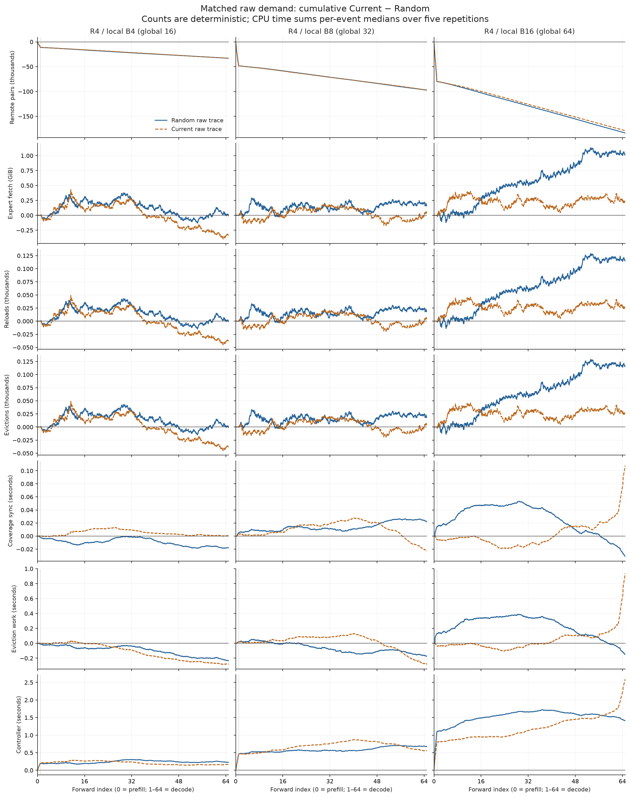
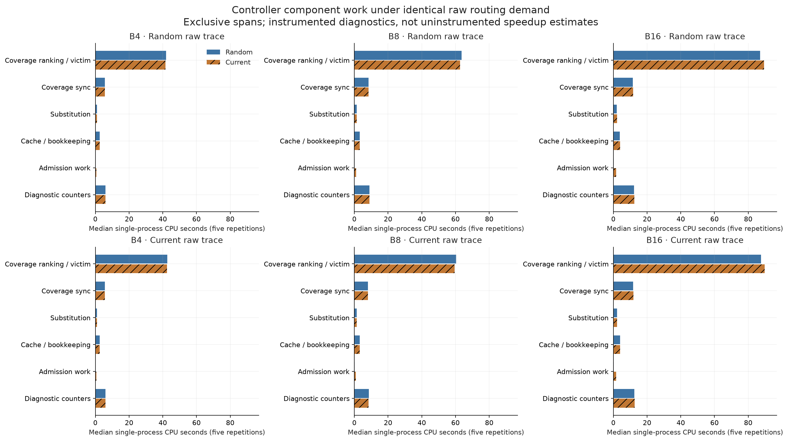
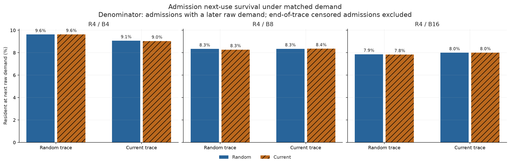
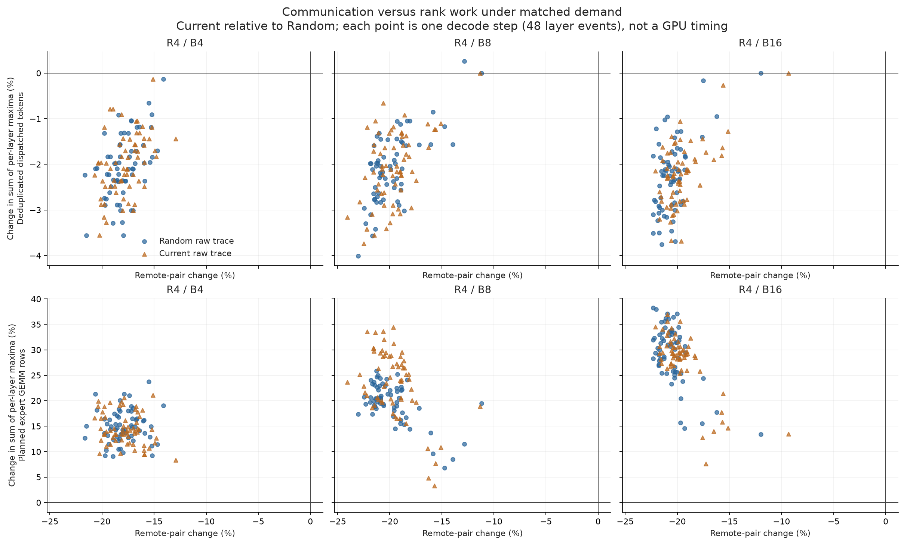

# Four-GPU admission trajectory and controller breakdown

The requested bounded diagnostic packet is complete: six R4 physical cells on GPUs **0,1,4,5**, followed by 60 single-process CPU replays. No R8 job was launched. All instrumentation/output/cache/fetch/replay correctness gates pass. The existing five-repeat uninstrumented study remains the performance evidence.

Under matched raw demand, Current reduces whole-generation remote pairs by **12.12–17.34%**, while the largest absolute net fetch change is only **0.123%** and next-use survival changes by at most **0.065 percentage points**. Hungarian cost construction plus assignment occupies at most **0.96%** of instrumented controller time. The sum of per-layer busiest-rank planned expert GEMM rows rises **14.42–29.21%** during decode. Event-level cache trajectories differ, but this packet does not establish large direct cache/fetch savings or a unique cause for the prior R4/B8 median slowdown.

## Protocol and evidence boundaries

Plan commit `30614bbc065c140060ef31af9bc4f8615ab16ca5`; prior results `e61758e`; measurement implementation `caf0143`. Qwen3-30B-A3B-Instruct-2507 BF16; cache30, gate .20/similarity .65, Coverage W128/k1/lambda2, hard expert-count quotas, seed42, no replication/migration. B4/B8/B16 are local batches (global 16/32/64). Each full run executes one prefill plus 64 decode forwards, producing 65 fixed-work tokens even after EOS.

A separate opt-in module wraps unchanged policy statements with exclusive CPU spans. The normal execution path has no diagnostic hooks. Smoke checks compare on/off full generated tokens, slots, cache and metrics for both policies on all four ranks. Full R4/B8 generated tokens also match every corresponding prior uninstrumented repeat. This does not constitute a new long-horizon quality evaluation.

Each batch uses both its Random and Current raw global router streams. On each stream, both policies start with empty independent cache/history/RNG and run five times: 3 batches × 2 streams × 2 policies × 5 repetitions = 60. Own-policy replay is a subset of this matrix and reproduces every physical plan/cache hash. Raw demand stays fixed; effective routes may change through substitution. These counterfactuals do not regenerate hidden states or test model quality. CPU replay omits unused affinity tables: Random/Current do not score them, and own-event hashes prove decision parity. Current’s existing absent-table fast return skips two disabled flag checks inside cost construction; physical diagnostic timers retain those checks. This small path difference limits exact physical CPU extrapolation.

Three independent single-process replay workers use distinct CPU affinities 180/182/184; each performs its own matrix serially with one numeric-library thread. Some CPU replay overlaps later GPU diagnostics. Other user jobs occupy GPUs 2,3,6,7 and share host resources. Repetition ranges reflect observed timing variability, not confidence intervals. Policies run in fixed Random-then-Current order within each repetition; this is not a randomized crossover. Host/order effects are not removed by using separate cores. A late read-only scheduler probe found kernel scheduling statistics disabled; runqueue waiting cannot be inferred from its counters, and no kernel setting was changed. No new diagnostic wall time is used as a speedup claim. Repetition zero additionally captures hashes/events outside the timed spans; later repetitions write timing/count records and verify the same final state and operation totals.

W128 covers global token rows, so decode histories span 8/4/2 events per layer at local B4/B8/B16. Cross-batch comparisons also change the question-prefix size (16/32/64 samples), so they do not isolate batch size from workload composition or history span. Next-use distances count global layer events; adjacent demand at the same layer is usually 48 events apart. Survival denominator includes only admissions with a later raw demand; all end-of-stream censoring is reported. Owner changes mean re-admission on another rank after eviction, never resident migration.

Physical H2D bytes are per-event native dispatcher fetch counts × 9 MiB/expert, validated against miss operations and run totals. No new CUPTI profile is collected. The unchanged executor and prior physical transfer audits support the interpretation; CPU replay bytes are predicted logical fetch volume.

## Existing uninstrumented evidence

The prior Random/Current medians show different directions across cells. R8 entries are retrospective context only. The new B4/B16 R4 probes do not have five-repeat uninstrumented timing in this packet.

| World / local B | Random E2E median [min, max] (s) | Current E2E median [min, max] (s) | Current change |
|---|---:|---:|---:|
| R4 / B8 | 120.364 [116.803, 121.562] | 126.049 [114.096, 191.796] | +4.72% |
| R8 / B4 | 133.008 [132.393, 135.865] | 82.232 [81.856, 83.209] | -38.18% |
| R8 / B8 | 143.286 [110.240, 163.294] | 168.704 [139.197, 169.312] | +17.74% |
| R8 / B16 | 152.738 [132.158, 206.723] | 140.619 [134.391, 226.097] | -7.93% |
| R8 / B32 | 168.681 [150.409, 252.806] | 164.442 [162.713, 180.663] | -2.51% |

Positive changes mean slower. The R4/B8 ranges overlap and Current varies substantially across five repeats; the +4.72% median is not proof of a stable causal slowdown. [Retrospective table](retrospective_summary.csv) includes TPOT, controller time, physical H2D, reloads, remote pairs and rank load. [Descriptive correlations](retrospective_correlations.json) are confounded by world/batch and repeated observations; no causal interpretation.

## Physical trajectories

One diagnostic generation per condition. These rows can differ in generated routing demand between policies; they are not the matched-demand causal comparison.

| Local B | Policy | Fetches | Evictions | Reloads | H2D (GiB) | Remote pairs | Mean token CV | Max/mean token load |
|---:|---|---:|---:|---:|---:|---:|---:|---:|
| 4 | random | 47,475 | 45,632 | 42,568 | 417.26 | 272,230 | 0.183 | 1.224 |
| 4 | hungarian_current | 48,370 | 46,527 | 43,397 | 425.13 | 239,421 | 0.284 | 1.401 |
| 8 | random | 69,974 | 68,131 | 64,848 | 615.01 | 561,980 | 0.157 | 1.195 |
| 8 | hungarian_current | 65,960 | 64,117 | 60,958 | 579.73 | 465,948 | 0.304 | 1.413 |
| 16 | random | 94,634 | 92,791 | 89,381 | 831.74 | 1,114,684 | 0.135 | 1.162 |
| 16 | hungarian_current | 95,867 | 94,024 | 90,635 | 842.58 | 935,948 | 0.271 | 1.382 |

[Physical rank receipts](physical_rank_receipts.json) retain all full generated tokens and diagnostic wall-time arrays; those times are not new speedup evidence. [Trajectory summary](trajectory_summary.csv) also reports exact/substitution hits, candidate visits, changed coverage layers, decode-step eviction/H2D rates and effective expert GEMM row imbalance. Complete per-event/rank trajectories and raw router metadata remain on the server.

## Matched raw demand: Current minus Random

Negative count/byte deltas mean less work for Current. Controller deltas subtract five-repeat total-time medians. Counts are deterministic; the cumulative timing plot instead sums event-wise five-repeat medians, which need not equal the median of totals.

| Local B | Raw source | Δ remote pairs | Δ fetches | Δ reloads | Δ H2D (GiB) | Δ controller (s) | Δ survival (pp) | First fetch divergence |
|---:|---|---:|---:|---:|---:|---:|---:|---:|
| 4 | random | -33,130 | +1 | +1 | +0.01 | +0.071 | +0.01 | 55 |
| 4 | hungarian_current | -33,019 | -38 | -38 | -0.33 | +0.258 | -0.03 | 55 |
| 8 | random | -97,424 | +19 | +19 | +0.17 | -0.328 | -0.06 | 49 |
| 8 | hungarian_current | -97,168 | +2 | +2 | +0.02 | -0.346 | +0.01 | 49 |
| 16 | random | -183,715 | +116 | +116 | +1.02 | +6.052 | -0.03 | 48 |
| 16 | hungarian_current | -178,962 | +26 | +26 | +0.23 | +4.321 | +0.00 | 48 |

### Fixed-demand policy effect versus raw-stream effect

The 2×2 replay isolates two descriptive steps: Random→Current policy on the Random raw stream, then Random→Current raw stream under Current policy. Their sum equals the own-trajectory difference. The reverse path is also retained in the data. Raw-stream changes contain model/substitution feedback; these are systems counterfactuals, not hidden-state interventions.

| B | Metric | Own Current − own Random | Policy effect on Random demand | Stream effect under Current |
|---:|---|---:|---:|---:|
| 4 | Fetch count | +895 | +1 | +894 |
| 4 | Controller median (s) | +1.328 | +0.071 | +1.257 |
| 8 | Fetch count | -4,014 | +19 | -4,033 |
| 8 | Controller median (s) | -4.540 | -0.328 | -4.212 |
| 16 | Fetch count | +1,233 | +116 | +1,117 |
| 16 | Controller median (s) | +5.215 | +6.052 | -0.837 |

Full two-direction accounting: [counterfactual decomposition](counterfactual_decomposition.csv).

Initial owners and communication differ before future fetch counts need diverge. “First fetch divergence” is the first global event with unequal admissions, including prefill. [Matched comparisons](matched_comparisons.csv) retain minimum/maximum cumulative fetch difference; [event deltas](cumulative_event_deltas.csv) expose changes of direction rather than hiding them in endpoint totals.

## Controller work and repeated CPU times

| Local B | Raw source | Policy | Controller median [min, max] (s) | Cost build median (s) | Assignment median (s) | Coverage ranking median (s) |
|---:|---|---|---:|---:|---:|---:|
| 4 | random | random | 59.719 [59.002, 77.169] | 0.000 | 0.000 | 41.966 |
| 4 | random | hungarian_current | 59.791 [59.366, 70.417] | 0.327 | 0.036 | 41.556 |
| 4 | hungarian_current | random | 60.789 [60.514, 61.593] | 0.000 | 0.000 | 42.778 |
| 4 | hungarian_current | hungarian_current | 61.048 [60.818, 74.481] | 0.328 | 0.036 | 42.586 |
| 8 | random | random | 89.793 [88.210, 90.165] | 0.000 | 0.000 | 63.617 |
| 8 | random | hungarian_current | 89.464 [88.016, 91.594] | 0.595 | 0.052 | 62.643 |
| 8 | hungarian_current | random | 85.598 [81.867, 85.890] | 0.000 | 0.000 | 60.382 |
| 8 | hungarian_current | hungarian_current | 85.253 [82.803, 88.566] | 0.584 | 0.048 | 59.567 |
| 16 | random | random | 122.638 [117.114, 140.818] | 0.000 | 0.000 | 87.103 |
| 16 | random | hungarian_current | 128.690 [118.995, 139.494] | 1.108 | 0.076 | 89.423 |
| 16 | hungarian_current | random | 123.531 [121.233, 150.864] | 0.000 | 0.000 | 87.578 |
| 16 | hungarian_current | hungarian_current | 127.853 [123.515, 148.776] | 1.084 | 0.076 | 89.718 |

[All 60 replay repetitions](replay_repeats.csv) retain every total and component timing. Exclusive spans are not GPU time. Timer/context-manager overhead remains in totals; explicit coverage-counter set operations have their own diagnostic accounting category. Route serialization, trajectory calculation and hashing lie outside event `controller_ns`, but inside physical diagnostic wall time and the legacy `controller_seconds` field of the diagnostic rank receipt. Component analysis uses the inner event timer, not that legacy outer field. Thus the diagnostic total is not an unbiased estimate of the prior uninstrumented controller. [Implementation audit](implementation_audit.md) separates measured operation counts from proposed follow-up opportunities. No controller optimization was applied.

## Next-use survival and concrete state examples

[Next-use summary](next_use_survival.csv) reports admissions, later demands, censored admissions, survival, exact/substitution/reload outcomes and owner changes on re-admission. Every admission-level record is retained server-side. [State examples](state_examples.md) contain at least five favorable and five unfavorable fetch-divergence events, with full cache snapshots, gate scores, independently computed Coverage damage and subsequent exact/substitute service until eviction. They explain concrete trajectories; they are not a new admission objective.

## Communication savings and rank load

Each point aggregates one decode step across 48 layer events. Each load numerator sums its per-layer rank maximum. Deduplicated dispatched-token maxima decrease slightly, while busiest-rank planned expert GEMM rows increase. Higher deduplicated-token CV alone would therefore be misleading: co-locating experts can reduce dispatch work while concentrating expert computation. These are per-step work-count proxies, not measured GPU durations.

## Hypotheses and limits

**H1 — future trajectory matters:** policy-dependent cache trajectories are verified under matched raw demand, but material net downstream savings must be assessed per cell rather than inferred from any nonzero difference. Endpoint cancellation, small count differences and timing variability can leave the historical E2E explanation unresolved. The decomposition above distinguishes a placement-policy effect on fixed demand from the different raw streams produced by physical generation. These counterfactuals do not imply identical model hidden states.

**H2 — the assignment solver is not the main controller cost:** supported within these diagnostics. Cost build plus solve is at most 0.96% of total controller time. Candidate ranking/victim selection and other downstream work dominate. Timing noise and instrumentation prevent assigning the entire historical E2E difference to one CPU component.

**H3 — expert-count quotas do not ensure expert-work balance:** busiest-rank planned expert GEMM rows increase under matched demand, although deduplicated dispatched-token maxima decrease. This verifies a compute-work imbalance proxy beyond aggregate CV, but a causal explanation of the historical R4/B8 slowdown from skew alone remains **inconclusive**. No new isolated GPU execution profile was collected; aggregate CV or correlation cannot separate compute skew, host/controller waiting and overlap. Do not add a load constraint based solely on this packet.

**H4 — direct NVSwitch byte saving is secondary:** remains limited to prior resident-only evidence. The earlier R4 fixed-event map sweeps had small/non-monotonic latency responses and varying rank compute loads. This packet does not independently isolate communication time and does not turn byte savings into additive E2E percentages.

## Validation and reproduction

26 CPU tests pass, including 320 stateful diagnostic on/off events. Eight rank/policy smoke receipts verify identical generated tokens/cache/metrics. All six full GPU cells contain 3,120 layer events; 24 rank receipts contain 74,880 rank events. Per-event physical fetches match admissions, every rank agrees on plans/cache, and own-policy CPU replay reproduces all physical event hashes. Forty full-output comparisons bind new B8 diagnostics to the prior five-repeat baseline. Five fresh-state repetitions in all 12 replay conditions preserve final cache/history/plan and operation totals.

Source/input/checkpoint/device binding: [manifest](measurement_manifest.json), [provenance](provenance.json), [validation](validation.json), [artifact hashes](artifact_hashes.json). Raw data root: `/home/hwlee/mgo-results/admission_trajectory_controller_breakdown_20261002`. Launch and analysis scripts are in `mgo_v2/scripts`; the measurement source hashes are frozen in the manifest. Raw trusted pickle router streams must only be loaded from this controlled directory.

Stop condition reached. Admission, Coverage, load constraints, same+path, replication/migration and controller optimization remain unchanged pending owner review.
