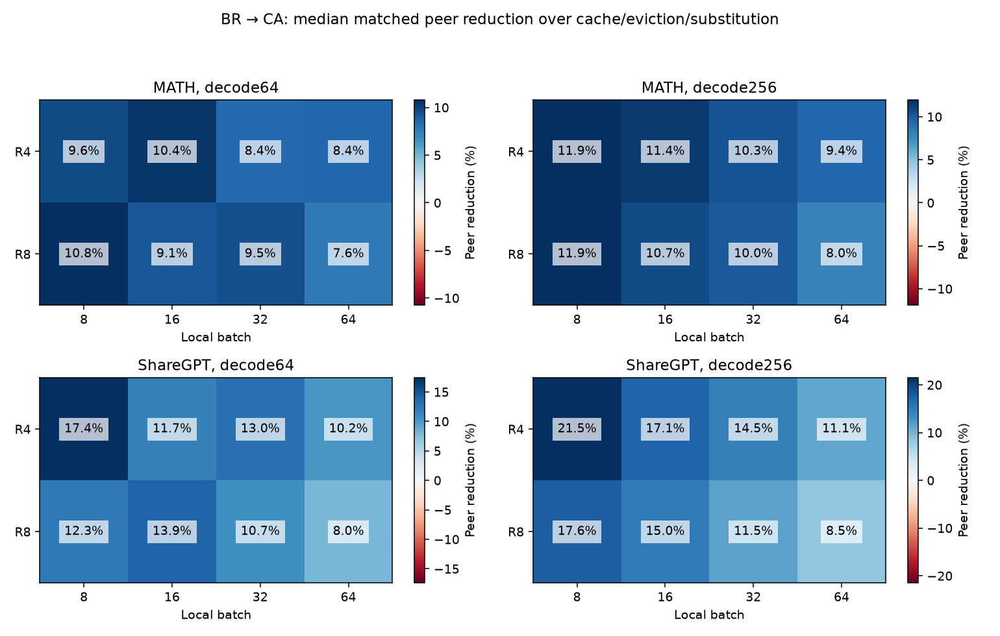
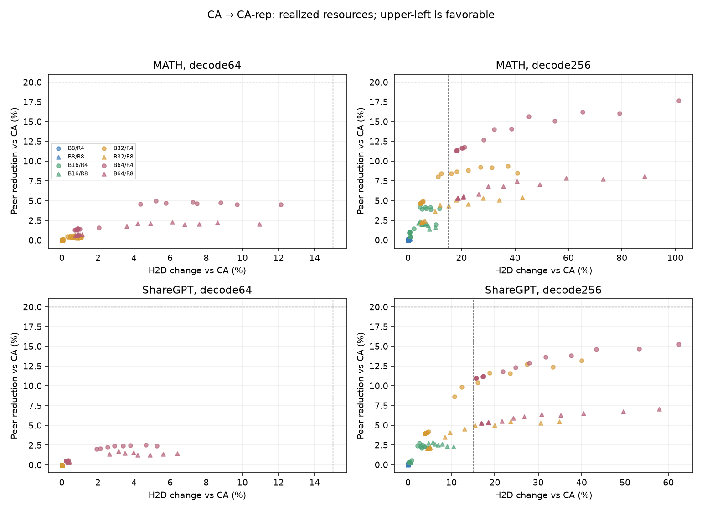
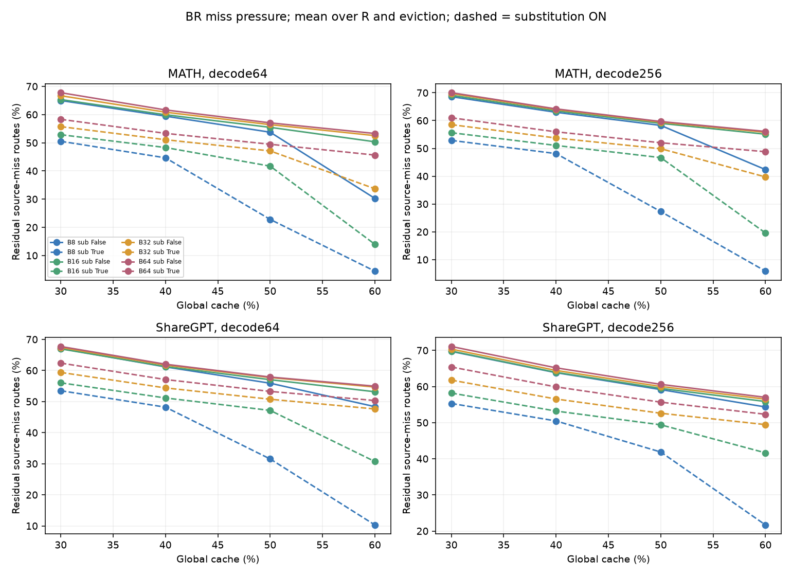
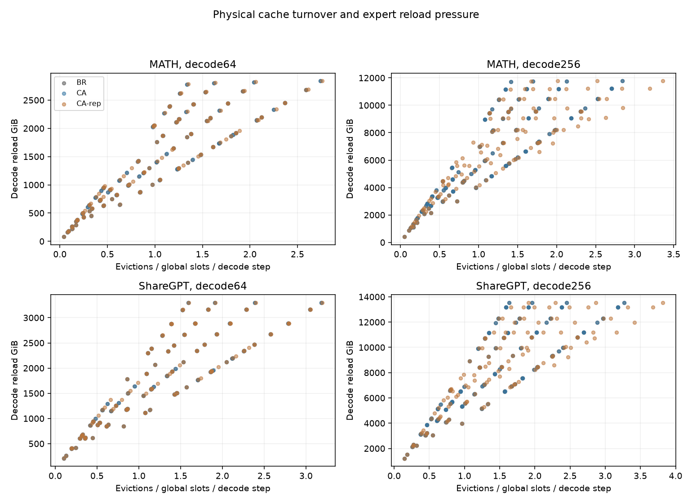
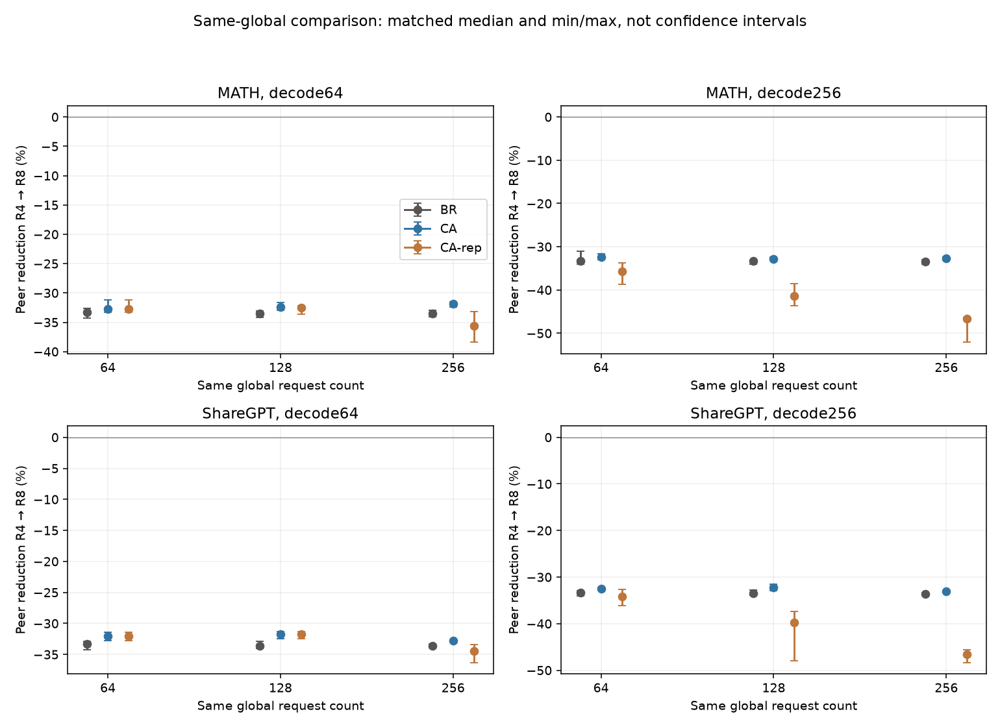
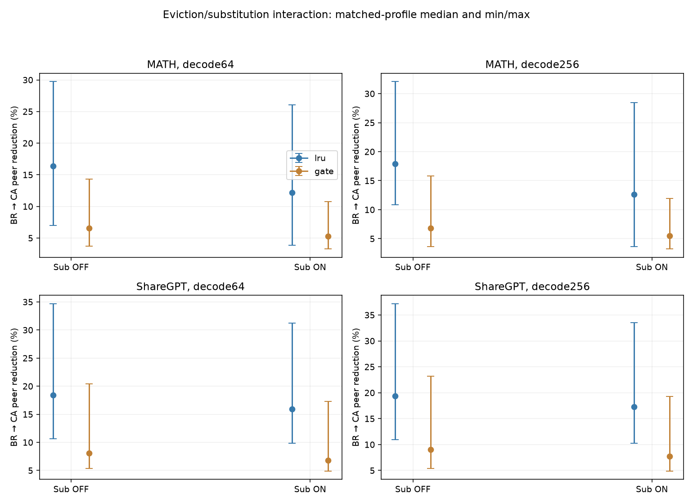
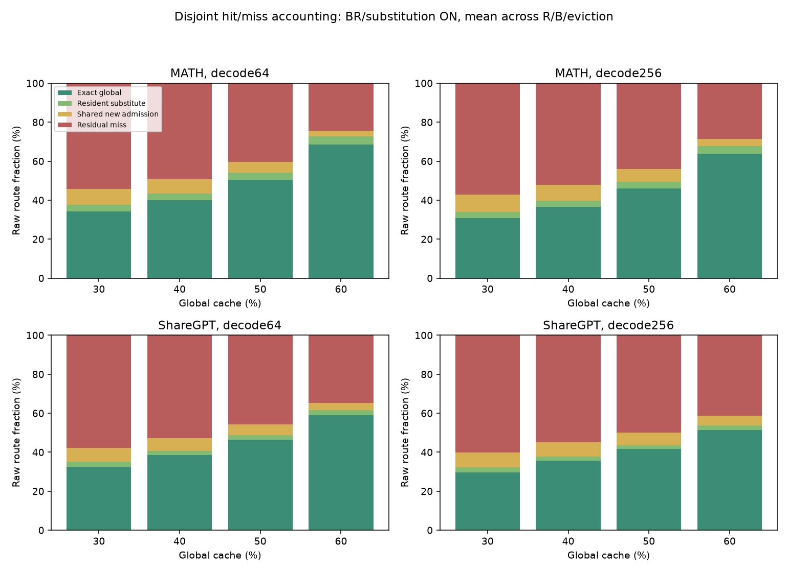

# BR / CA / CA-rep: two-horizon resource headroom

**Complete: 1,536 main CPU replays and 16 frozen BR seed-audit replays.**

CA reduces median peer bytes by 9.32–13.07% across the four dataset/horizon groups, with median H2D changes of +0.02–+0.09%. Its joint headroom criterion passes in 283/512 matched comparisons. CA-rep adds median peer reductions of 0.00–3.01%; its largest observed reduction is 17.67%. The joint labels below determine whether these changes meet the predeclared thresholds; larger replica gains must be assessed together with their extra H2D.

MATH and ShareGPT each have one 512-request exact-model master capture on eight GPUs: one prefill and 256 decode forwards. The same loaded model replicas served both datasets. Decode64 is a prefix of decode256, not a second GPU generation. Existing same-checkpoint FineWeb-Edu 400×128 SERE Frobenius similarity was verified and reused.

This study measures frozen-route physical resources, not latency, bandwidth equivalence, accuracy or autoregressive quality under intervention. Profile medians/ranges give equal weight to configurations and are not confidence intervals.

## Predeclared findings

- **CA_HEADROOM**: 283 qualifying main cells; witness IDs are in interpretation.json.
- **CA_STRONG_HEADROOM**: 33 qualifying main cells; witness IDs are in interpretation.json.
- **CA_REP_HEADROOM**: 0 qualifying main cells; witness IDs are in interpretation.json.
- **CA_REP_TRADEOFF**: 0 qualifying main cells; witness IDs are in interpretation.json.
- **SUBSTITUTION_RELIEVES_MISS_PRESSURE**: 565 qualifying main cells; witness IDs are in interpretation.json.
- **HIGH_MISS_PRESSURE**: 981 qualifying main cells; witness IDs are in interpretation.json.

CA_HEADROOM requires ≥10% peer reduction and H2D within ±2%; CA_STRONG_HEADROOM uses ≥25%, with the same rank-quota check. CA_REP_HEADROOM requires ≥20% peer reduction with H2D increase ≤15%; otherwise a ≥20% reduction is CA_REP_TRADEOFF. Counts below apply these joint conditions, not just the best isolated metric.

| Dataset | Decode | Comparison | Peer reduction median [min, max] % | H2D change median [min, max] % | Pareto improvements | Joint headroom |
|---|---:|---|---:|---:|---:|---:|
| MATH | 64 | BR_to_CA | 9.32 [3.27, 29.72] | +0.09 [-1.23, +4.62] | 27/128 | 58/128 |
| MATH | 64 | CA_to_CA-rep | 0.01 [0.00, 4.96] | +0.00 [+0.00, +12.13] | 0/128 | 0/128 |
| MATH | 256 | BR_to_CA | 10.04 [3.23, 32.07] | +0.02 [-0.77, +2.07] | 30/128 | 65/128 |
| MATH | 256 | CA_to_CA-rep | 3.01 [-0.02, 17.67] | +5.62 [-0.01, +101.36] | 0/128 | 0/128 |
| ShareGPT | 64 | BR_to_CA | 11.13 [4.90, 34.68] | +0.03 [-0.61, +2.73] | 50/128 | 75/128 |
| ShareGPT | 64 | CA_to_CA-rep | 0.00 [0.00, 2.55] | +0.00 [+0.00, +6.40] | 0/128 | 0/128 |
| ShareGPT | 256 | BR_to_CA | 13.07 [4.89, 37.17] | +0.02 [-0.05, +0.51] | 42/128 | 85/128 |
| ShareGPT | 256 | CA_to_CA-rep | 2.35 [-0.03, 15.24] | +4.46 [+0.00, +62.42] | 1/128 | 0/128 |

Each group contains the same 128 R/batch/cache/eviction/substitution coordinates. Lower H2D and lower peer are jointly favorable; no single weighted resource winner is imposed.

## What the longer raw trace adds

| Dataset | Decode64 mean active experts/layer-event | Decode256 | Top-10% demand share, 64 → 256 | Seen64 pairs recurring later | Early/late hot-set Jaccard |
|---|---:|---:|---:|---:|---:|
| MATH | 105.18 | 109.03 | 38.40% → 34.55% | 99.25% | 0.559 |
| ShareGPT | 122.23 | 125.42 | 35.35% → 30.97% | 99.97% | 0.618 |

The hot set is the 103 highest-demand expert/rank pairs per layer. Jaccard compares steps 1–64 with 65–256. Recurrence is raw observed demand and does not establish cache residency or quality. The per-layer CSVs also retain event/cumulative demand p50/p90/p99/max, gate mass and recurrence gaps.

## Cache hits, substitution and miss pressure

All hit/miss metrics are measured before admission. Exact local hits are a subset of exact global hits. A substituted source can reuse a resident expert or share a newly admitted protected expert; the latter is kept separate from cache hits. Exact global + resident substitute + shared admission + residual source miss partitions raw routes and gate mass exactly. Effective hit = exact global + resident substitute. Effective local hits and post-admission local service are separately recorded.

| Dataset | Decode | Resident substitute route / mass % | Shared new-admission route / mass % | All substitution route / mass % | Median residual-miss reduction ON vs OFF % |
|---|---:|---:|---:|---:|---:|
| MATH | 64 | 3.72 / 2.95 | 5.94 / 4.82 | 9.66 / 7.76 | 25.84 |
| MATH | 256 | 3.40 / 2.78 | 6.99 / 5.81 | 10.40 / 8.59 | 21.91 |
| ShareGPT | 64 | 2.29 / 1.90 | 5.84 / 4.93 | 8.14 / 6.83 | 17.38 |
| ShareGPT | 256 | 2.21 / 1.85 | 6.70 / 5.71 | 8.91 / 7.56 | 17.23 |

Hit fractions above are equal-profile means. Full route-count and gate-mass values are in grid_points. HIGH_MISS_PRESSURE means residual source-miss routes ≥30% or at least one global-cache turnover per decode step. Native substitution thresholds remain .20 gate protection and .65 SERE similarity.

## Placement and replica interpretation

BR and CA use the identical balanced quota rule for a given current miss count (rank count difference ≤1). Their realized miss sets and numerical quotas can later diverge as cache trajectories evolve, which is why H2D differences are measured. CA exactly maximizes local effective expert-route demand with an integer Hungarian assignment. This minimizes return expert rows for that event, but dispatch coalescing makes it different from globally minimizing dispatch-plus-return bytes. Every reported peer value recomputes both components. Cumulative rank-fetch imbalance is also recorded: balanced event quotas do not imply identical cumulative counts.

CA-rep only considers newly admitted residual-miss experts. Its V is an optimistic upper bound: two 4096-byte rows times strictly later raw decode demand on one non-primary rank. It admits at V≥9 MiB, at most one replica per new expert, with ordinary unprotected LRU/Gate eviction afterwards. No rho budget, migration, refresh, future eviction or future substitution is used. V bins below/above the threshold are retained for all new experts. This bound can overestimate dispatch savings; realized bytes decide the labels.

Replica reuse excludes admission-event service. Final never-reused counts include both evicted and still-alive copies without later use. Replica-victim reloads identify a last global disappearance caused directly by replica admission, not a full causal decomposition; matched reload changes versus CA are supplied separately.

Same-global comparisons use the same first N requests for R4/B16 vs R8/B8, R4/B32 vs R8/B16, and R4/B64 vs R8/B32. Origin mapping, per-rank slots and rank-major GateHistory order change with R. Full-router probabilities are retained so each W128 history is reconstructed for that actual order.

## BR randomness audit

Exactly 16 extra cells use seeds 7 and 99: each dataset/horizon has R4/B8/cache30/LRU/OFF and R8/B64/cache60/Gate/ON anchors. Seed42 is already present in the main grid. No seed was selected after observing results.

Across these fixed anchors, alternative-seed peer changes relative to seed42 range from -0.12% to +0.44%; H2D changes range from -0.22% to +0.05%. The seed audit is limited to these anchors and is not a confidence interval for all cells.

## Validation and execution

- All 1,552 cells passed. BR/CA have 512 exact 64-step CPU-prefix matches across horizons.
- 168 CA-rep cells with zero replicas match CA resources and final state exactly.
- Exact byte identities, raw/effective gate mass, disjoint hit/miss accounting, quota imbalance and physical capacity were checked for every cell.
- Independent tiny dictionary replays, exhaustive assignment optima, R8 fixtures, native substitution and complete before/after traffic checks are preserved in policy_tests.json and pack validation receipts.
- Model weight shards, SERE calibration, source datasets, selected requests and trace files are hash-pinned. No capture was repeated for a CPU configuration.
- Maximum aggregate replay RSS: 6.64 GiB; maximum single-cell RSS: 578.3 MiB. CPU concurrency ≤16, threads=1, CUDA hidden; guards enforce ≤32 GiB aggregate and ≥512 GiB available before each wave.
- Eight resident exact Qwen replicas were loaded once; each processed MATH then ShareGPT. The final decode forward consumes token256 and discards logits, preserving exactly 256 generated tokens and 256 decode route steps. No quality or transport timing was performed.
- The owner explicitly added both CPU horizons after 986ba64. The preceding dynamic-refresh experiment remains stopped at 99/120 cells and was not resumed.

## Outputs

grid_points contains full/decode resources and hit/miss accounting for all cells. policy_comparisons, substitution_comparisons and same_global_comparisons preserve matched differences. seed_audit lists all extra-seed comparisons. interpretation contains label witnesses; validation and cell_receipts preserve checks and external raw-result hashes. Horizon audits describe the two raw prefixes.

Stop for owner review. No Env1/Env2 timing, accuracy run, retuning or further sweep follows automatically.

## Figures

