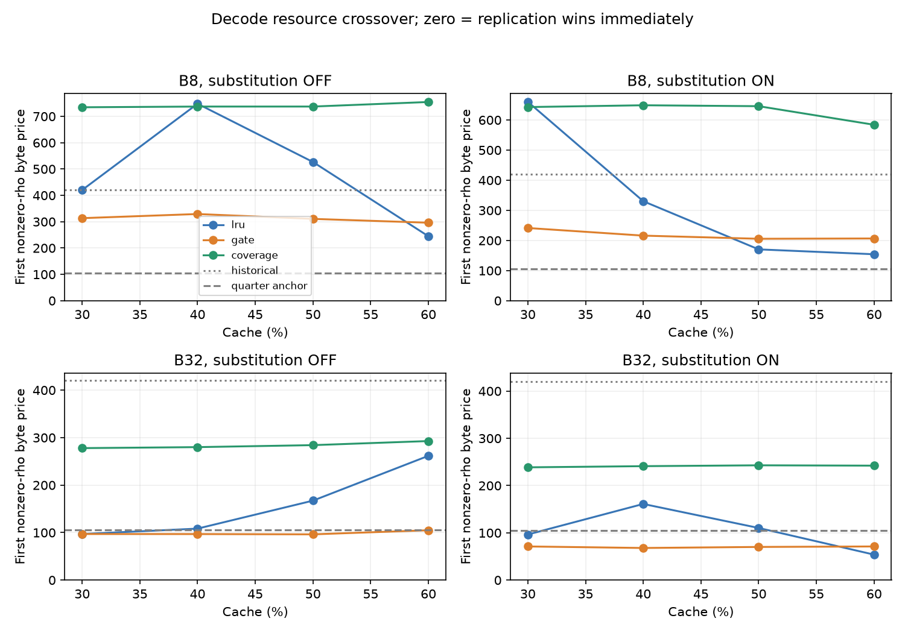
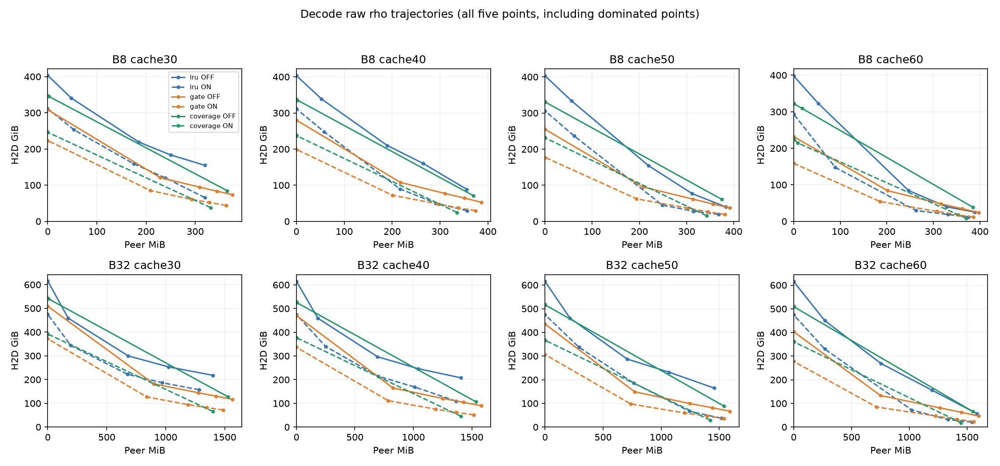
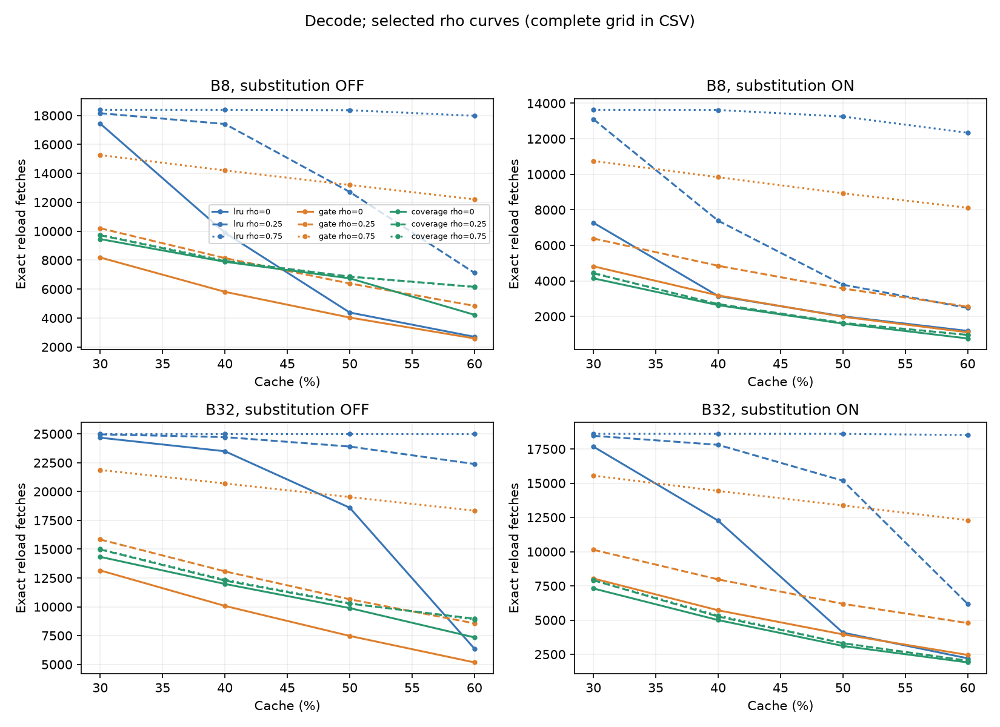
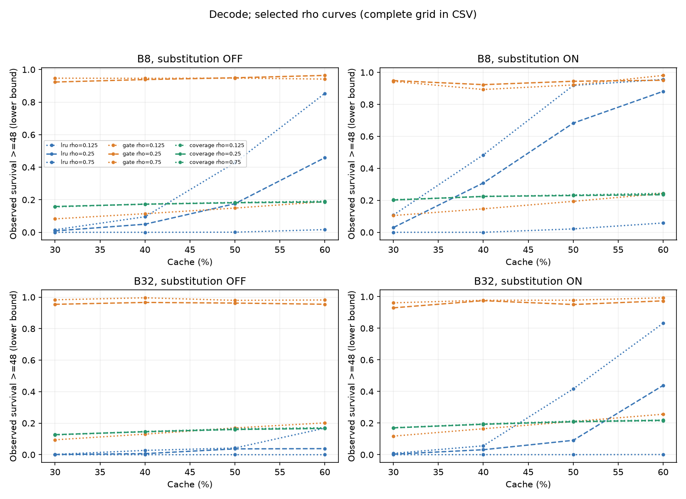
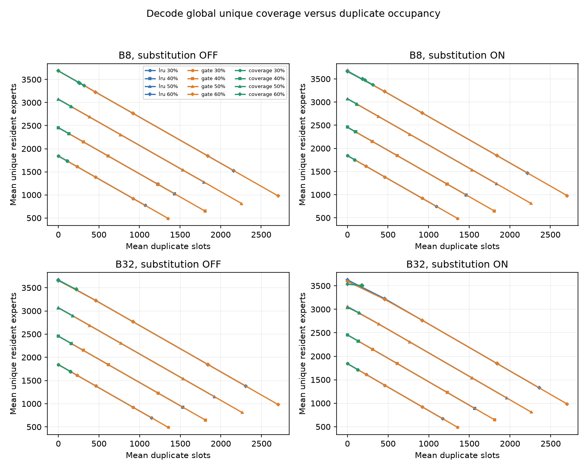
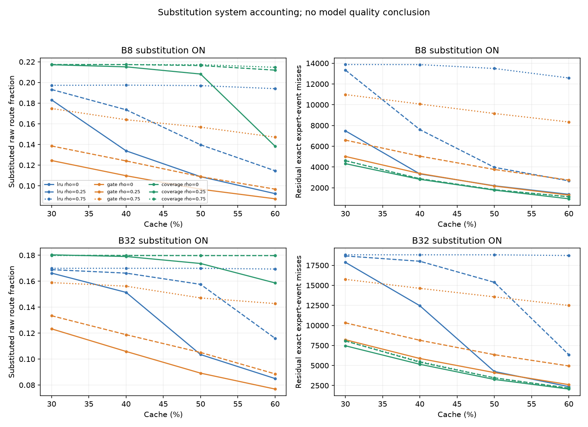
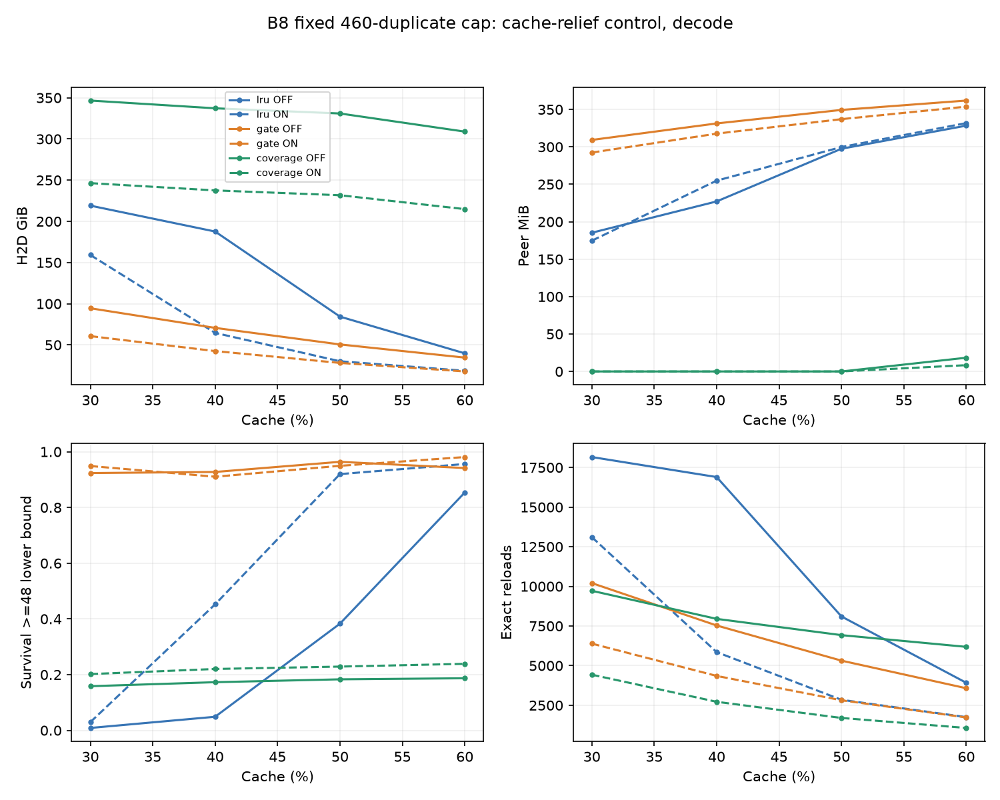

# Cache, eviction and substitution: bounded system accounting

Status: complete. Labels: **CACHE_RELIEF, EVICTION_HEADROOM, SUBSTITUTION_SYSTEM_HEADROOM, REPLICATION_REGIME_SHIFT**.

At a fixed 460-duplicate-slot cap, B8/LRU/OFF cache30 to cache60 changes decode H2D from 219.076 to 39.797 GiB and peer traffic from 185.297 to 328.332 MiB. Observed replica survival>=48 rises from 0.87% to 85.37%. This rescues lifetime and fetch pressure, but increases communication; it is not joint byte dominance.

B32/cache30/LRU/OFF has a first replication crossover of 97.071643, compared with the historical B8 anchor 420.223139. This cross-batch result meets the predeclared quarter-anchor rule. The complete same-batch cache/policy comparisons follow below.

No B8 configuration meets that 4x price-reduction rule: its lowest first crossover is 154.174052, above 105.055785. B8 replication-regime witnesses instead come from the separately declared dominance of matched historical B8 points.

All 264 CPU cells completed: 120 B8 fractional-rho, 24 B8 fixed-460, and 120 B32 fractional-rho. The five historical cache30/LRU/OFF points match full/decode counters and final cache hashes exactly; their S1 runs are reused, not repeated. Both diagnostic captures match historical tokens, routes, selected weights, owners and plan/cache hashes on every rank.

This is frozen-route byte accounting. Substitution changes model computation, and its autoregressive routes and accuracy were not measured. Lambda is a byte-resource price, not a timing or bandwidth multiplier.

## Decode first replication crossover

| Batch | Eviction | Substitution | Cache30 | Cache40 | Cache50 | Cache60 |
|---|---|---|---:|---:|---:|---:|
| B8 | lru | OFF | 420.223 | 748.011 | 526.781 | 244.707 |
| B8 | lru | ON | 660.409 | 330.294 | 170.349 | 154.174 |
| B8 | gate | OFF | 313.445 | 329.160 | 310.705 | 296.155 |
| B8 | gate | ON | 241.320 | 216.031 | 205.553 | 206.548 |
| B8 | coverage | OFF | 734.637 | 737.334 | 737.393 | 754.664 |
| B8 | coverage | ON | 642.962 | 648.926 | 645.854 | 584.145 |
| B32 | lru | OFF | 97.072 | 108.418 | 167.338 | 261.699 |
| B32 | lru | ON | 96.506 | 161.135 | 110.299 | 53.868 |
| B32 | gate | OFF | 97.048 | 96.934 | 96.349 | 104.974 |
| B32 | gate | ON | 71.178 | 67.977 | 70.164 | 71.178 |
| B32 | coverage | OFF | 277.952 | 280.039 | 284.223 | 292.825 |
| B32 | coverage | ON | 238.640 | 241.113 | 242.912 | 242.207 |

Zero means a nonzero-rho policy wins for arbitrarily small nonnegative price. The full rational envelopes, including dominated rho points, are in frontier_summary.json.

## Representative matched K-budget and fixed-cap coordinates

| Batch | Cache | Eviction | Sub | Budget | H2D GiB | Peer MiB | Reloads | Unique residents | Survival >=48 |
|---|---:|---|---|---|---:|---:|---:|---:|---:|
| B8 | 30% | lru | OFF | rho .25 | 219.076 | 185.297 | 18,157 | 1383.0 | 0.87% |
| B8 | 30% | coverage | OFF | rho .25 | 346.623 | 0.000 | 9,721 | 1730.4 | 15.85% |
| B8 | 30% | coverage | ON | rho .25 | 246.393 | 0.000 | 4,428 | 1753.5 | 20.21% |
| B8 | 60% | lru | OFF | rho .25 | 84.472 | 246.547 | 7,123 | 2765.0 | 45.86% |
| B8 | 60% | coverage | OFF | rho .25 | 322.559 | 0.000 | 6,159 | 3436.2 | 18.60% |
| B8 | 60% | coverage | ON | rho .25 | 224.930 | 0.000 | 958 | 3470.1 | 23.47% |
| B32 | 30% | lru | OFF | rho .25 | 299.848 | 681.449 | 24,961 | 1383.0 | 0.10% |
| B32 | 30% | coverage | OFF | rho .25 | 541.995 | 0.000 | 14,972 | 1694.4 | 12.71% |
| B32 | 30% | coverage | ON | rho .25 | 391.825 | 0.000 | 7,910 | 1717.2 | 16.97% |
| B32 | 60% | lru | OFF | rho .25 | 269.306 | 753.836 | 22,390 | 2765.0 | 3.83% |
| B32 | 60% | coverage | OFF | rho .25 | 508.975 | 0.000 | 8,971 | 3465.2 | 16.66% |
| B32 | 60% | coverage | ON | rho .25 | 360.615 | 0.000 | 2,040 | 3508.6 | 21.74% |
| B8 | 40% | lru | OFF | 460 slots | 187.620 | 227.117 | 16,895 | 1997.0 | 4.88% |
| B8 | 50% | lru | OFF | 460 slots | 84.357 | 297.496 | 8,101 | 2612.0 | 38.30% |
| B8 | 60% | lru | OFF | 460 slots | 39.797 | 328.332 | 3,917 | 3226.0 | 85.37% |

## Predeclared labels

- **CACHE_RELIEF**: 8 qualifying comparisons; full witnesses in interpretation.json.
- **EVICTION_HEADROOM**: 47 qualifying comparisons; full witnesses in interpretation.json.
- **SUBSTITUTION_SYSTEM_HEADROOM**: 105 qualifying comparisons; full witnesses in interpretation.json.
- **REPLICATION_REGIME_SHIFT**: 42 qualifying comparisons; full witnesses in interpretation.json.

The cache-relief label uses only matched B8 fixed-460 controls. The eviction and substitution labels use matched fractional-rho grid cells. The replication-dominance clause uses historical B8 at the same rho; B32 lambda comparisons against the B8 numeric anchor are explicitly marked. These are existence labels, not claims that every rho or workload improves.

## Lifetimes and substitution limits

Replica lifetimes are physical-copy lifetimes in global layer events. Admission-event service does not count as reuse. Lifetime percentiles include observed lower bounds for end-of-trace censored copies. Survival>=48 is the observed-survivor/all-admission lower bound; unknown short censored copies and a known-outcome fraction are included in replica_lifecycle.csv. Decode lifetime cohorts include decode-born copies, while decode service/eviction counters include all copies used or evicted in decode.

The trace contains one prefill and eight decode forwards; these are short-horizon, cold-start accounting results, not steady-state estimates. W128 is a token window: B8/global32 spans four decode events per layer, while B32/global128 spans one. Batch comparisons therefore include both changed demand and this prescribed history horizon.

Substitution counts accepted source expert-events; route/gate-mass fractions use raw selected routes and weights before target merging. Similarities are source-event weighted. H2D avoided is the signed difference against the matched OFF replay, not a timing saving.

## Validation and resource use

- CPU replay peak RSS: 893.18 MiB; hard 8-GiB address-space limit, one process and one BLAS/OMP thread.
- Capture peak process-tree RSS: 231.26 GiB; no OOM or memory-guard failure.
- GPU 0/1/4/5 resident-model workers were restored after capture; GPU 2/3/6/7 were untouched.
- All cells enforce physical capacities, duplicate caps, active protection, legal destinations and independent send/receive transpose counting.
- All six cache30 fixed-460 controls equal their rho=.25 counterparts in full/decode accounting and final cache state.
- Small policy tests independently check historical actions, ragged traffic, protected substitution, and every GATE/COVERAGE victim against direct global-unique coverage.
- No quality evaluation, B64/B128 capture, R8, NCCL timing, or physical F/K/C was run. Stop for owner review.

## Files

Complete full/decode counters: grid_points and fixed_duplicate_control CSV/JSON. Matched mechanism comparisons: substitution_summary, eviction_summary, replica_lifecycle. Exact envelopes: frontier_summary. Interpretation witnesses: interpretation.json. Raw capture/cell receipt paths and hashes: S0_capture.json, trace_readiness.json and cell_receipts.json.

## Figures

