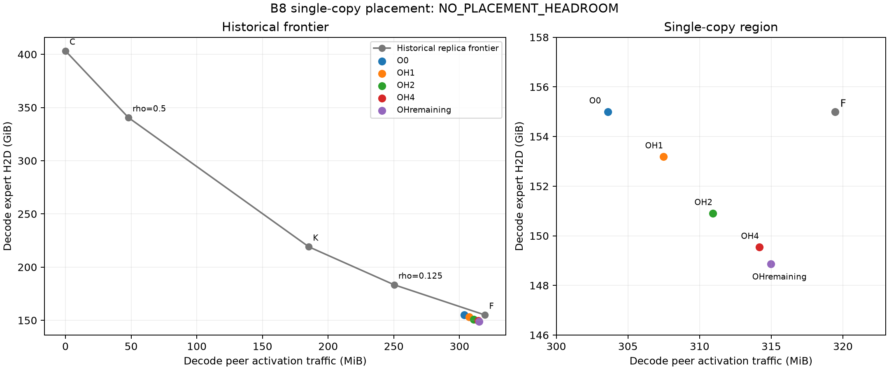

# Future rank-affinity single-copy placement

**NO_PLACEMENT_HEADROOM** — CPU byte accounting only; no TPOT/E2E timing claim.

All 18 fixed cells completed (six policies across B8/B16/B32). Each cell was independently invoked again solely for deterministic validation; full event/cache/decision hashes matched. B8 F exactly reproduced 17,635 fetches, 166,424,739,840 H2D bytes, 334,970,880 peer bytes and 23,179 remote token-rank pairs. F cache/LRU states and traffic matrices matched the independent reference at every one of 432 events per batch and invocation.

## Actual B8 coordinates

| Policy | H2D GiB | Peer MiB | Changed owners | Next-demand survival |
|:---|---:|---:|---:|---:|
| F | 154.995 | 319.453 | 0.00% | 4.53% |
| O0 | 155.004 | 303.594 | 8.92% | 4.29% |
| OH1 | 153.193 | 307.492 | 17.07% | 5.44% |
| OH2 | 150.908 | 310.934 | 19.56% | 6.75% |
| OH4 | 149.546 | 314.180 | 21.25% | 7.49% |
| OHremaining | 148.860 | 314.965 | 21.88% | 7.50% |

## Current placement versus future affinity

| Batch | Comparison | Peer-byte reduction | H2D ratio |
|---:|:---|---:|---:|
| 8 | F → O0 | 4.96% | 1.0001 |
| 8 | O0 → OH1 | -1.28% | 0.9883 |
| 8 | O0 → OH2 | -2.42% | 0.9736 |
| 8 | O0 → OH4 | -3.49% | 0.9648 |
| 8 | O0 → OHremaining | -3.75% | 0.9604 |
| 16 | F → O0 | 6.21% | 0.9917 |
| 16 | O0 → OH1 | -0.27% | 0.9926 |
| 16 | O0 → OH2 | -1.04% | 0.9880 |
| 16 | O0 → OH4 | -1.22% | 0.9952 |
| 16 | O0 → OHremaining | -1.71% | 0.9967 |
| 32 | F → O0 | 6.49% | 0.9917 |
| 32 | O0 → OH1 | -1.10% | 0.9928 |
| 32 | O0 → OH2 | -1.70% | 0.9924 |
| 32 | O0 → OH4 | -2.47% | 0.9942 |
| 32 | O0 → OHremaining | -2.87% | 0.9961 |

B8 O0 reduces peer bytes by 4.9645% with H2D ratio 1.000057 versus F. The predeclared modest threshold is 5%; all decisions use unrounded integer comparisons. The best OH peer reduction versus O0 is -1.2841% (a negative reduction means more traffic). No threshold was adjusted after observing results.

The descriptive lowest-peer B8 future policy is **OH1**. F→O0 measures current placement quality; only O0→OH measures incremental future-affinity value. 'Best' here means lowest peer bytes, not a latency-optimal choice. Gate evaluation checks every OH policy, not just this descriptive winner.

The full per-policy gates and dominated historical rho points are in `frontier_comparison.json`. Historical K/C use replicated prefills; the new single-copy policies share F prefill. B16/B32 are trend checks only, with no invented historical K/C references.

## Interpretation and measurement boundaries

- A globally missing expert gets exactly one copy, only on a currently requesting rank. Already-resident copies never move; no duplicate, prefetch, substitution or load-balancing objective is present.
- Current-event decisions proceed by expert ID with prior choices fixed and undecided misses using the F heuristic. Future costs freeze other experts at F destinations and include current plus the allowed future steps. Actual evictions and reloads follow original physical LRU.
- Owner divergence compares each actual miss to its same-event F heuristic. Survival excludes admissions without an observed next demand. Attribution is an exact joint owner counterfactual on the actual cache, separate from whole-policy differences.
- Eight decode steps bound lookahead and observed survival; this offline diagnostic is not globally optimal and is not an online predictor.
- A positive CPU gate does not authorize new GPU/model captures, timing or a controller. Stop for owner review.

## Validation

- Fourteen targeted and regression tests passed before execution. Peak process RSS: 707.75 MiB under a hard 4-GiB address-space bound.
- All 18 cell pairs have identical replay hashes. Source sizes/SHA256 and cross-rank receipts passed; historical CPU frontier files are unchanged.
- Single-copy residency, no resident migration, miss-only admissions, active protection, capacities and traffic transpose checks passed throughout.
- No Torch/CUDA/NCCL/model work was launched. Existing model workers on GPUs 0/1/4/5 were preserved; the owner-stopped 2/3/6/7 workers were not restarted.

See [coordinates](placement_points.json), [owner accounting](owner_choice_summary.json), [frontier](frontier_comparison.json), [validation](validation.json), and [execution protocol](EXECUTION_PROTOCOL.md).
