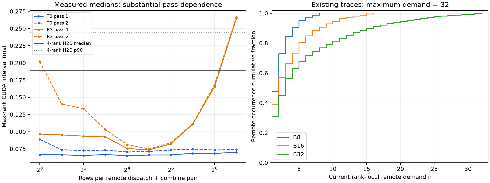

# Hot-expert replication break-even

**CURRENT_BATCH_TOO_COLD under the frozen pooled-median H4 rule.** This is not a robust universal threshold: R3 has substantial pass/order dependence. No H3 cell or larger-batch capture was run.

The preceding single-copy placement packet completed at `85283b0` before H0/H1 started. This packet uses existing traces, then model-free pair communication and one-expert pinned H2D calibration on GPU 0/1/4/5. R3 is synthetic P2P-disabled SHM, not a physical PCIe-only server.

## Current rank-local hotness

| Local batch | Remote n p50 | p90 | p95 | p99 | Max |
|---:|---:|---:|---:|---:|---:|
| 8 | 2 | 4 | 5 | 8 | 8 |
| 16 | 2 | 8 | 11 | 15 | 16 |
| 32 | 3 | 16 | 21 | 29 | 32 |

Every candidate satisfies exact current saving ≤ 2×n×4096 bytes. Thus even n=32 can save at most 256 KiB of current peer traffic, versus a 9-MiB expert fetch. This is byte accounting only; equal bytes do not imply equal costs. Individual marginal dispatch savings interact, so coverage uses their explicitly labeled nonadditive sum.

## Measured crossover rows

| Mode | H2D condition | Metric | H2D ms | Pooled n* | Pass 1 n* | Pass 2 n* |
|:---|:---|:---|---:|:---|:---|:---|
| T0 | single-rank | median | 0.181296 | >512 | >512 | >512 |
| T0 | single-rank | p90 | 0.182384 | >512 | >512 | >512 |
| T0 | four-rank-concurrent | median | 0.188768 | >512 | >512 | >512 |
| T0 | four-rank-concurrent | p90 | 0.244646 | >512 | >512 | >512 |
| R3 | single-rank | median | 0.181296 | 512 | 512 | 1 |
| R3 | single-rank | p90 | 0.182384 | 1 | 512 | 1 |
| R3 | four-rank-concurrent | median | 0.188768 | 512 | 512 | 1 |
| R3 | four-rank-concurrent | p90 | 0.244646 | 512 | 512 | 1 |

Pair passes were T0→R3 then R3→T0, with ten warmups and thirty measured samples per n/pass; pooled estimates use sixty paired max-rank samples. H2D has ten warmups and thirty samples per condition. No linear extrapolation, extra sizes, retuning or statistical repetitions were added.

**Important sensitivity:** R3 single-pass crossover is 512 in the first pass and 1 in the second. Pooled single-rank p90 also crosses at n=1, covering all remote occurrences. The preselected four-rank concurrent H2D p90 is higher, so its pooled crossover is 512. These differences prevent treating 512 as a stable intrinsic hardware threshold or claiming an established monotonic bandwidth crossover. The measured CUDA interval includes communication launch pacing and scheduling; it is not pure wire-transfer time.

## Coverage, replay gate and larger-batch decision

- H2 reports all eight transport/H2D/metric combinations for every batch, including the single-rank p90 n=1 result. That result has 100% remote candidate/route/marginal-byte coverage; all other pooled combinations have zero coverage in current traces.
- Before measurement, H3 was assigned the four-rank concurrent H2D condition, yielding at most four thresholds per batch. Both T0 thresholds are >512, both R3 thresholds are 512, and no existing remote demand exceeds 32. H3 is therefore SKIPPED_NO_CANDIDATES; no threshold-policy or frontier result is fabricated.
- H4 uses the optimistic single-rank R3 pooled median n*=512. B32 maximum 32 is below 0.5×512=256, so the predeclared result is CURRENT_BATCH_TOO_COLD. B8→B16→B32 p99/max grows monotonically, but the magnitude gate fails. No B64 proposal/capture or B128 capture is initiated.
- The isolated thresholds exclude victim eviction and reload cost, so they are optimistic for replication. The current evidence does not establish an actionable hot/cold controller, especially given the R3 pass sensitivity. Stop without extra timing or GPU/model experiments.

## Startup correction and validation

- Both transport smokes passed: P2P/IPC for T0 and SHM/direct/direct for R3. INFO logging was confined to those smokes; timing processes had no NCCL debug environment.
- The first timing process failed an environment assertion before any timing/NCCL initialization because bootstrap injected NCCL_P2P_DISABLE=0. Failure evidence was committed at ed8e912; 597b224 applied the same post-bootstrap cleanup as the existing validated workers. Successful smokes were retained, and only the five unexecuted measurement processes ran. Failed data was not overwritten.
- All four completed pair passes and both H2D conditions passed payload checks outside timing. The 40 pair-size/pass cells contain 1,200 timed pairs; H2D contains 60 timed samples. All raw evidence has size/SHA256 receipts.
- H0 CPU peak RSS 117.89 MiB, H2 peak RSS 153.09 MiB, each under 4-GiB address space. H1 peak sampled process-tree RSS 5.59 GiB; minimum host available 1840.78 GiB. No OOM occurred.
- One exact marginal accounting unit test and two crossover boundary/nonmonotonicity tests passed. Existing F reproduction from the completed placement packet remains hash-identical.
- Model workers were restored on GPU 0/1/4/5 at local batch1024; live receipts were checked. Owner-stopped workers on GPU 2/3/6/7 were not restarted. The post-experiment snapshot shows other processes on those GPUs, which were not touched; that snapshot does not establish their timing relative to calibration.

See [hotness](hotness_distribution.json), [marginal savings](hotness_peer_saving.json), [microcosts](break_even_microcost.json), [coverage](threshold_coverage.json), [H4 gate](H2_H4.json), [validation](validation.json), and [execution conventions](EXECUTION_PROTOCOL.md).
