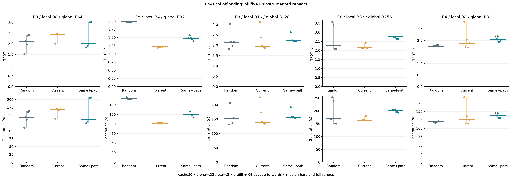
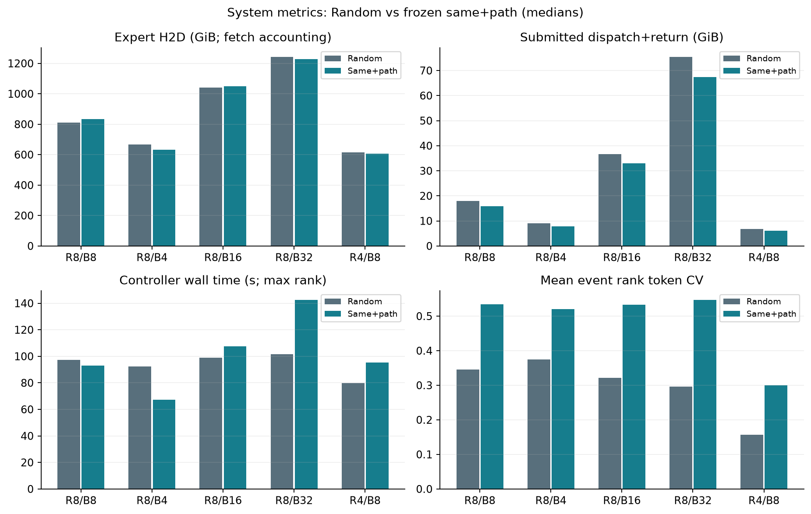
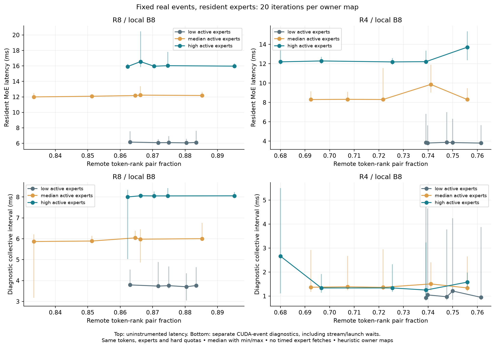
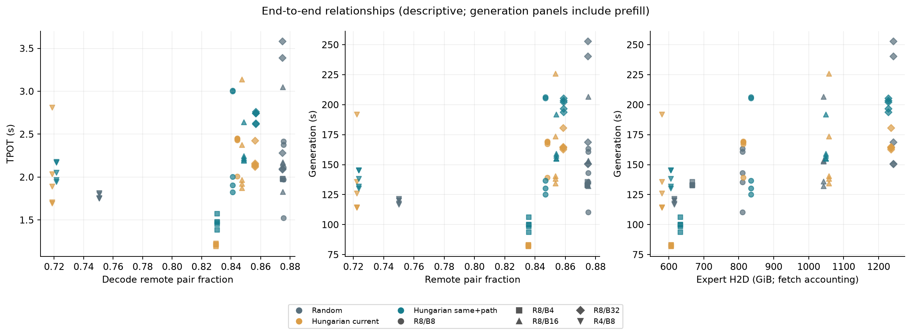

# Physical local/remote TPOT and E2E results

The prespecified C-policy E2E acceptance gate does not pass in both primary anchors. Do not claim a general communication-aware E2E speedup from this study.

Primary anchor medians, C2 versus Random: R8/B8 TPOT -5.01% and generation time -4.65%; R4/B8 TPOT +16.79% and generation time +14.83%. Positive changes mean slower; these are descriptive five-repeat medians.

Owner-requested larger-batch results, C2 versus Random: R8/B16 median TPOT +2.95% and generation time +3.25%; R8/B32 median TPOT +20.36% and generation time +19.84%. Positive changes mean slower. These additional cells do not replace the original B8 acceptance anchors.

Plan commit: `1a98d10ac17557e7a9112e12ad36d07fe5d5be27`. Measurement implementation: `e8458d4`. Raw evidence: `/home/hwlee/mgo-results/local_remote_e2e_impact_20261001`.

Execution followed the owner's R8 → R4 order. Stage A has 30 event/map cells, 600 uninstrumented resident iterations and 600 separate CUDA-event diagnostic iterations. Stage B has 15 conditions × five repeats (75 generations, 540 rank receipts). The two preselected R8/B8 posthoc profiles ran only after all primary timing completed.

## Fixed protocol

Qwen3-30B-A3B-Instruct-2507 BF16 on H100 NVSwitch; cache30; Coverage W128/k1/lambda2; expert-level gate .20/similarity .65 substitution; support64/alpha=.25, path support64/eta=.5; seed42; hard quotas, one residency controller, no migration/replication. Every repeat resets logical/physical expert cache and policy history. Dense weights and CUDA allocator/kernel caches stay loaded. All study GPU jobs ran sequentially.

R8 uses physical GPUs 0–7. At the owner's request, both R4 stages use physical GPUs 0, 1, 4, 5 (logical ranks 0, 1, 2, 3 respectively). Every worker's recorded visibility and strict NUMA binding are checked before accepting its results.

64 decode steps are **one prefill plus 64 decode forwards, producing 65 fixed-work tokens**. EOS ends answer scoring, while timed computation continues. TPOT is the average of max-rank decode step wall times; generation time is the max-rank continuous wall interval. This is fixed-work generation, not production serving throughput or long-horizon task quality. The R8/B4 control uses the same first 32 questions as R4/B8; R8/B8 uses 64 questions. The owner-requested R8/B16 and B32 expansion uses 128 and 256 questions, respectively, and ran before the R4 jobs with identical policy coefficients and decode length. The original B8 acceptance anchors and preselected two profiles were retained.

W128 counts global routed-token rows, not decode steps. R8/B16 fills the window with one decode event. At R8/B32, all 256 tokens execute but the rank-major history retains only the last 128 rows (ranks 4–7) for gate-history scoring. This frozen implementation behavior limits interpreting B32 as a uniform all-rank history experiment; the window and row order were not retuned.

[Execution binding](EXECUTION_BINDING.md) specifies selection, solver, timer and byte definitions. [Manifest](measurement_manifest.json) binds the inputs and implementation.

## Stage B: all five repeats

Values are median [minimum, maximum], in seconds. Every individual repeat is available in [e2e_repeats.csv](e2e_repeats.csv), with per-rank times/fetches in [e2e_rank_receipts.csv](e2e_rank_receipts.csv). Conditions were run in fixed sequential policy blocks, so temporal effects are not removed by randomized interleaving.

| Ranks / local batch | Policy | TTFT | TPOT | Generation |
|---|---|---:|---:|---:|
| R8 / B8 | Random | 8.880 [8.156, 12.788] | 2.112 [1.523, 2.415] | 143.286 [110.240, 163.294] |
| R8 / B8 | Hungarian current | 12.171 [10.660, 12.753] | 2.437 [2.009, 2.453] | 168.704 [139.197, 169.312] |
| R8 / B8 | Hungarian same+path | 8.535 [8.262, 13.711] | 2.006 [1.823, 3.011] | 136.622 [125.080, 206.384] |
| R8 / B4 | Random | 6.292 [5.945, 9.002] | 1.979 [1.976, 1.984] | 133.008 [132.393, 135.865] |
| R8 / B4 | Hungarian current | 4.692 [4.523, 5.544] | 1.213 [1.193, 1.227] | 82.232 [81.856, 83.209] |
| R8 / B4 | Hungarian same+path | 5.553 [4.880, 5.717] | 1.476 [1.387, 1.571] | 99.848 [93.634, 106.270] |
| R8 / B16 | Random | 14.518 [9.595, 15.004] | 2.159 [1.831, 3.050] | 152.738 [132.158, 206.723] |
| R8 / B16 | Hungarian current | 15.179 [14.466, 25.128] | 1.966 [1.874, 3.141] | 140.619 [134.391, 226.097] |
| R8 / B16 | Hungarian same+path | 15.356 [13.970, 23.149] | 2.223 [2.195, 2.639] | 157.698 [155.007, 192.020] |
| R8 / B32 | Random | 22.712 [16.596, 23.617] | 2.281 [2.091, 3.581] | 168.681 [150.409, 252.806] |
| R8 / B32 | Hungarian current | 26.865 [25.369, 28.297] | 2.150 [2.122, 2.427] | 164.442 [162.713, 180.663] |
| R8 / B32 | Hungarian same+path | 27.909 [25.665, 28.931] | 2.745 [2.621, 2.761] | 202.152 [193.879, 205.316] |
| R4 / B8 | Random | 5.269 [4.618, 7.853] | 1.759 [1.753, 1.817] | 120.364 [116.803, 121.562] |
| R4 / B8 | Hungarian current | 5.661 [5.101, 11.888] | 1.890 [1.694, 2.811] | 126.049 [114.096, 191.796] |
| R4 / B8 | Hungarian same+path | 6.184 [5.941, 6.728] | 2.055 [1.944, 2.178] | 138.209 [130.426, 145.330] |

## C2 versus Random

Positive E2E/remote reduction means less time/traffic; positive fetch change means more H2D. Ratios below use condition medians. Whole-generation locality/payload includes prefill; decode-only fields are also retained in the repeat table.

| Ranks / local batch | TPOT speedup | E2E reduction | Remote-pair reduction | Remote-fraction change | Fetch change |
|---|---:|---:|---:|---:|---:|
| R8 / B8 | 1.053× | +4.65% | +21.35% | -2.84 pp | +3.02% |
| R8 / B4 | 1.341× | +24.93% | +23.45% | -3.89 pp | -5.00% |
| R8 / B16 | 0.971× | -3.25% | +19.74% | -2.10 pp | +0.64% |
| R8 / B32 | 0.831× | -19.84% | +22.61% | -1.62 pp | -1.18% |
| R4 / B8 | 0.856× | -14.83% | +17.61% | -2.65 pp | -1.51% |

Do not attribute the full timing difference to NVLink: admission also changes resident experts, future substitutions, expert fetches, controller CPU work and rank load. Physical expert bytes below are dispatcher fetch accounting; the posthoc profiles independently verify actual copies for the two selected R8/B8 conditions.

## Stage A: resident communication sensitivity

The same real token states, selected expert identities, BF16 arithmetic and hard quotas are reused across all five owner maps for each event. Every output matches its captured exact-routing reference bitwise. All timed iterations have zero physical expert fetches. The unchanged direct-slot binary's earlier CUDA trace audits establish no hidden per-hit expert upload or full-expert D2D. This stage checks the actual fetch counter and residency on every iteration; it does not collect a new CUPTI transfer trace.

Endpoints minimize/maximize exact deduplicated remote-pair **count** using fixed-budget quota-preserving swaps, not a globally optimal solver. Thus map labels do not promise monotonic fractions: the total number of local+remote pairs can change too. Real shared-expert demand and hard quotas limit the attainable fraction range; this is not an all-local versus all-remote experiment. Global expert arithmetic is fixed but per-rank compute distribution can change, so load CV remains a relevant covariate, and these results do not isolate link hardware latency.

| Ranks | Event | Active experts | Achieved remote-fraction range | Median MoE latency range (ms) |
|---|---|---:|---:|---:|
| R8 | low | 12 | 0.863–0.883 | 6.061–6.160 |
| R8 | median | 59 | 0.833–0.885 | 11.999–12.229 |
| R8 | high | 99 | 0.862–0.895 | 15.920–16.561 |
| R4 | low | 12 | 0.739–0.761 | 3.800–3.873 |
| R4 | median | 49 | 0.692–0.756 | 8.298–9.862 |
| R4 | high | 88 | 0.680–0.756 | 12.189–13.711 |

Across the five owner maps, within-event median latency spreads (max/min − 1) are 1.64–4.02% at R8 and 1.92–18.85% at R4. The plotted fixed events do not show a uniform monotonic latency increase with remote fraction. These bounded ranges must be read together with per-rank load redistribution and iteration variability.

[Cell summaries](local_remote_sensitivity.csv) and [all iterations](local_remote_iterations.csv) publish achieved fractions, route-local fractions, loads, payload and timing. MoE wall times are uninstrumented. Separate diagnostic CUDA-event intervals around dispatch/combine include stream/launch waits and are not isolated NCCL kernel durations. Routing metadata exchange and controller/solver time are excluded from these resident fixed-plan layer timings.

## Relationships

TPOT is plotted against decode-only remote-pair fraction; generation panels use whole-generation counters. [Regression support](regression_support.csv) and [OLS coefficients](descriptive_regression.json) implement the prespecified descriptive model with remote pairs, expert H2D, controller time and rank CV. Predictors are correlated and workload/world effects remain. There are 75 rows from 15 repeated conditions. No p-values, causal attribution or independent-sample generalization are claimed.

## Two posthoc profiles

Nsight Systems 2025.6.1 uses the previously validated configuration, with periodic stack snapshots disabled. Both profiles preserve every generated token (including after EOS), configuration, policy metric and physical fetch count from uninstrumented repeat 0. All observed large expert H2D transfers are 9 MiB and actual expert H2D equals logical fetch bytes on all 16 rank/cell combinations. No full-expert D2D remains.

| R8/B8 policy | Actual expert H2D (GiB) | H2D/GEMM overlap (% of rank-summed H2D intervals) | Max-rank NCCL kernel union (s) |
|---|---:|---:|---:|
| b8_C0_balanced_random | 810.580 | 2.96% | 57.800 |
| b8_C2_hungarian_same_path | 835.066 | 3.38% | 56.695 |

[Profile summary](profile_summary.csv) and [rank receipts](profile_rank_receipts.csv) also include controller CPU wall time and gaps without recorded GPU kernel/copy/memset activity. NCCL kernels include device-side waits for peers; an active polling kernel is not counted as idle. GEMM overlap includes dense and expert matrix kernels. These overlapping diagnostic intervals must not be stacked or substituted for primary uninstrumented TPOT/E2E. Giant raw traces remain on the server.

## Validation and stop

[24 CPU tests](cpu_tests.txt) pass. The [binary reuse audit](baseline_reuse_audit.json) reconstructs the original validated runtime fingerprint using the current compiled binary. Prior R1/R4/R8 native and slot-view parity gates are reused with the unchanged compute/cache/collective implementation. New real-event incidence checks independently validate locality counters; actual submitted Stage-A tensors match dispatch+return byte formulas. All five repeats have identical full token sequences and semantic/cache counters in every rank. All 540 Stage-B physical-fetch receipts pass. [Validation](validation.json) includes source receipt hashes and the runtime fingerprint; [profile transfer audit](profile_transfer_audit.json) binds observed H2D.

Submitted peer bytes exclude self traffic, router/count all-gather metadata and wire protocol overhead. Supplementary `all_submitted_peer_tx_bytes` adds router/count all-gather tensor copies and is independently checked against posthoc submission counters. Both full-generation and decode-only accounting are preserved. The OS exposes only NUMA node 0: no physical remote-NUMA or PCIe-only conclusion follows. Two warmup calls and five sequential repeats do not remove all clock, allocator or temporal variability. The optional 128-step confirmation was not run; the primary study and exactly two posthoc profiles define this execution's scope.

**Stopped for owner review.** No timing-based coefficient tuning, replication, migration, quota change or additional policy search was performed.
