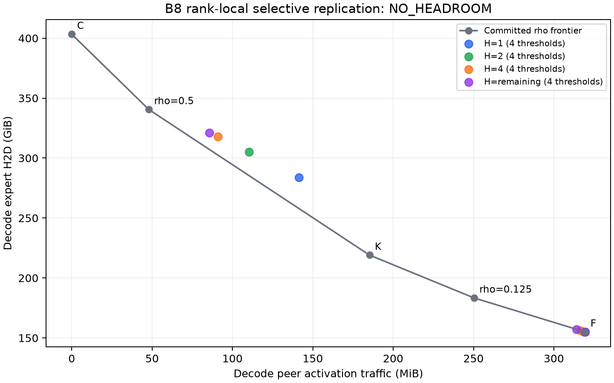

# Rank-local reuse and selective replication headroom

**NO_HEADROOM** — CPU accounting only; no E2E speedup claim.

The B8 rho0 replay exactly reproduced F: 17,635 fetches, 166,424,739,840 expert H2D bytes, 334,970,880 peer bytes and 23,179 remote token-rank pairs. Destinations, traffic matrices, fetch classes and full physical cache/LRU state matched the independent reference at all 432 events.

## Rank-local reuse

| Local batch | Observed remote pairs | Top 10% marginal byte share | Byte share recurring within 4 steps | Gate |
|---:|---:|---:|---:|:---|
| 8 | 9434 | 37.23% | 73.70% | PASS |
| 16 | 11211 | 40.06% | 78.03% | PASS |
| 32 | 12960 | 43.69% | 80.06% | PASS |

The gate weights current **individual candidate marginal** bytes, not total wire traffic. Shared dispatch rows create interactions, so individual marginals are not additive joint savings. Recurrence is truncated at the eighth decode step; current-event savings are excluded from all future scores.

## Persistence-only upper bound

| Batch | Horizon | Positive candidates / all | Maximum future peer saving (KiB) | Max peer/fetch byte ratio | Byte break-even candidates |
|---:|:---|:---|---:|---:|---:|
| 8 | 1 | 5066 / 9434 | 56.0 | 0.00608 | 0 |
| 8 | 2 | 5870 / 9434 | 84.0 | 0.00911 | 0 |
| 8 | 4 | 6491 / 9434 | 144.0 | 0.01562 | 0 |
| 8 | remaining | 6748 / 9434 | 232.0 | 0.02517 | 0 |
| 16 | 1 | 6143 / 11211 | 100.0 | 0.01085 | 0 |
| 16 | 2 | 7316 / 11211 | 160.0 | 0.01736 | 0 |
| 16 | 4 | 8190 / 11211 | 276.0 | 0.02995 | 0 |
| 16 | remaining | 8557 / 11211 | 432.0 | 0.04688 | 0 |
| 32 | 1 | 6961 / 12960 | 212.0 | 0.02300 | 0 |
| 32 | 2 | 8823 / 12960 | 332.0 | 0.03602 | 0 |
| 32 | 4 | 9860 / 12960 | 624.0 | 0.06771 | 0 |
| 32 | remaining | 10272 / 12960 | 1132.0 | 0.12283 | 0 |

One hypothetical replica costs 9 MiB. These ratios are byte accounting, not equivalent time costs. Each bound assumes a free, persistent replica for one pair; sums of independent candidates are not a joint oracle policy.

## Capacity-aware replay

Exactly 16 predeclared horizon/threshold cells were run per available batch. All use original physical slots/LRU and protected active experts. Future scores are frozen F marginals; a unique victim needed within H adds one projected fetch, dividing the score by two. Strict score > threshold admits a copy; ties use expert ID then rank. Prefill is identical to F without optional copies. Old K/C have historical greedy prefills, so their decode-start states may differ.

| B8 cell | Peer MiB | H2D GiB | Replica admissions | Later local reuse | Victim reloads | Dominated old rho |
|:---|---:|---:|---:|---:|---:|:---|
| H1/T0KiB | 141.465 | 283.852 | 13718 | 0.01% | 6754 | [] |
| H1/T64KiB | 319.453 | 154.995 | 0 | 0.00% | 0 | [] |
| H1/T256KiB | 319.453 | 154.995 | 0 | 0.00% | 0 | [] |
| H1/T1024KiB | 319.453 | 154.995 | 0 | 0.00% | 0 | [] |
| H2/T0KiB | 110.195 | 305.262 | 16154 | 0.01% | 7386 | [] |
| H2/T64KiB | 318.777 | 155.127 | 15 | 46.67% | 8 | [] |
| H2/T256KiB | 319.453 | 154.995 | 0 | 0.00% | 0 | [] |
| H2/T1024KiB | 319.453 | 154.995 | 0 | 0.00% | 0 | [] |
| H4/T0KiB | 90.926 | 317.971 | 17600 | 0.01% | 7647 | [] |
| H4/T64KiB | 316.754 | 156.217 | 87 | 26.44% | 33 | [] |
| H4/T256KiB | 319.453 | 154.995 | 0 | 0.00% | 0 | [] |
| H4/T1024KiB | 319.453 | 154.995 | 0 | 0.00% | 0 | [] |
| Hremaining/T0KiB | 85.770 | 321.161 | 17963 | 0.01% | 7728 | [] |
| Hremaining/T64KiB | 314.137 | 157.201 | 159 | 44.65% | 61 | [] |
| Hremaining/T256KiB | 319.453 | 154.995 | 0 | 0.00% | 0 | [] |
| Hremaining/T1024KiB | 319.453 | 154.995 | 0 | 0.00% | 0 | [] |

At threshold zero, only 1–1 replicas per cell serve a later local demand out of 13,718–17,963 admissions. Mean copy lifetimes are 18.33–20.86 layer events, versus 48 layer events to the next same-layer decode opportunity.

Replica reuse counts only a later local service before eviction; current-event service is excluded. End-of-trace survivors are right-censored. All lifecycle counts and actual coordinates, including secondary B16/B32, are in the selective replay files. No secondary historical frontier is invented.

## Secondary batch coordinates

No historical K/C points exist for these batches. The table shows each freshly reproduced F and the selective cell with the lowest peer bytes; this is not a secondary headroom classification.

| Batch | F peer MiB | F H2D GiB | Lowest-peer cell | Selective peer MiB | Selective H2D GiB |
|---:|---:|---:|:---|---:|---:|
| 16 | 684.152 | 189.536 | Hremaining/T0KiB | 156.094 | 420.249 |
| 32 | 1399.285 | 217.978 | Hremaining/T0KiB | 290.363 | 501.478 |

Temporal demand recurs, but this bounded selective policy does not dominate any old nonzero-rho point once real slots, evictions and reloads are included. This does not prove that every possible selective policy is useless; it does not justify an online controller or GPU follow-up.

## Validation and stage boundary

- Peak study process RSS: 720.78 MiB, under a hard 4-GiB address-space limit; CUDA hidden and BLAS/OMP threads fixed at one.
- Eleven targeted/cache regression tests passed before tracing. Raw receipt sizes/SHA256 and committed cross-rank provenance were verified. Original CPU Pareto artifacts remain hash-identical.
- No model, Torch, CUDA or NCCL work was launched by this study. The owner’s eight resident-model GPU worker PIDs remained unchanged.
- Full per-occurrence, per-candidate, physical-state and replica-lifetime records are compressed outside Git with hashes. Compact summaries and per-pair statistics are checked in.
- Eight decode steps bound observed reuse and replica lifetimes. Frozen-F scoring is not a globally optimal capacity oracle. No new threshold, horizon, repeat, cache ratio or physical F/K/C run was added.
- Stop research work for owner review. Keep the requested resident-model idle load running.

See [pair summaries](reuse_pair_summary.json), [horizons](reuse_horizon_summary.json), [persistence bounds](persistence_upper_bound.json), [frontier comparison](frontier_comparison.json), [validation](validation.json), and [execution conventions](EXECUTION_PROTOCOL.md).
