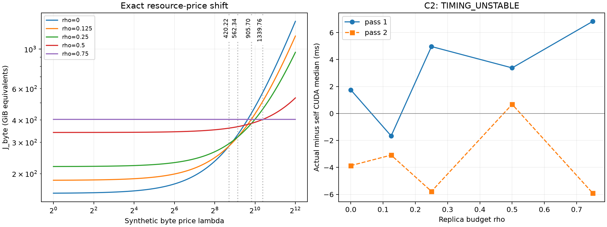

# Synthetic communication-price crossover

**TIMING_UNSTABLE**. The exact CPU result remains **RESOURCE_PRICE_SHIFT**.

Only the original B8/cache30 five-rho frontier was used. C0 source outputs, raw capture sizes/hashes and historical producer source blobs were verified. C1 imported the original hashed greedy replica implementation and reproduced all full/prefill/decode totals and final cache hashes; 2,160 action/state events matched the independent frozen applier.

## Exact byte resource prices

| Transition rho | Exact lambda | Decimal lambda |
|:---|:---|---:|
| 0 ↔ 0.125 | 7435008/17693 | 420.223139 |
| 0.125 ↔ 0.25 | 9363456/16651 | 562.335956 |
| 0.25 ↔ 0.5 | 31843584/35159 | 905.702210 |
| 0.5 ↔ 0.75 | 16448256/12277 | 1339.761831 |

The first transition is lambda=420.223139: one peer byte must be priced at that many H2D byte-equivalents for rho=0.125 to tie F. The optimal budget then increases through .25, .5 and .75. This dimensionless resource-price result is not a latency or PCIe/NVLink bandwidth ratio.

## Actual versus matched self-only timing

| Pass | rho | Actual CUDA ms | Self CUDA ms | Remote premium ms |
|---:|---:|---:|---:|---:|
| 1 | 0 | 36.808609 | 35.058815 | 1.749794 |
| 1 | 0.125 | 35.967487 | 37.631744 | -1.664257 |
| 1 | 0.25 | 40.733761 | 35.768257 | 4.965504 |
| 1 | 0.5 | 38.591488 | 35.209854 | 3.381634 |
| 1 | 0.75 | 41.096737 | 34.262623 | 6.834114 |
| 2 | 0 | 35.996674 | 39.863297 | -3.866623 |
| 2 | 0.125 | 37.805950 | 40.893566 | -3.087616 |
| 2 | 0.25 | 42.312511 | 48.091648 | -5.779137 |
| 2 | 0.5 | 40.289536 | 39.610687 | 0.678848 |
| 2 | 0.75 | 30.155680 | 36.068321 | -5.912642 |

Each median uses five full-trace max-rank CUDA intervals after one warmup. All twenty cells retained exactly 768 collective calls and their original self rows. Self-only zeroed off-diagonal counts. Buffers/events were preallocated and payload checks stayed outside timing. Raw negative residuals are not clipped. Wall and event aggregations are secondary in the timing artifacts.

## Predeclared timing gate

| Pass | Check | rho | Passed |
|---:|:---|---:|:---|
| 1 | nonnegative_remote | 0 | True |
| 1 | nonnegative_remote | 0.125 | False |
| 1 | nonnegative_remote | 0.25 | True |
| 1 | nonnegative_remote | 0.5 | True |
| 1 | defined_rho0_normalization | 0 | True |
| 1 | adjacent_normalized_premium | 0.125 | False |
| 1 | adjacent_normalized_premium | 0.25 | False |
| 1 | adjacent_normalized_premium | 0.5 | True |
| 1 | zero_remote_control_agreement | 0.75 | False |
| 2 | nonnegative_remote | 0 | False |
| 2 | nonnegative_remote | 0.125 | False |
| 2 | nonnegative_remote | 0.25 | False |
| 2 | nonnegative_remote | 0.5 | True |
| 2 | defined_rho0_normalization | 0 | False |
| 2 | adjacent_normalized_premium | 0.125 | False |
| 2 | adjacent_normalized_premium | 0.25 | False |
| 2 | adjacent_normalized_premium | 0.5 | False |
| 2 | zero_remote_control_agreement | 0.75 | False |

The owner selected normalization by same-pass rho0 remote premium. Each adjacent nonzero-traffic rho must have normalized premium ≤1.10× its predecessor, with nonnegative premiums and a defined positive rho0 denominator. The zero-remote rho=.75 actual/self control must agree within 10% of self.

The zero-remote controls differ by +19.95% and -16.39% in the two passes, despite identical traffic counts. Negative premiums also occur for nonzero-traffic policies. Actual-minus-self is therefore not a validated remote-cost estimate in this run.

C2 failed, so **no C3 H2D time model or C4 gamma sweep is accepted or published**. The exact C0 shift is established, but the experiment cannot assign it a validated time-price crossover. No extra repetitions, NCCL tuning, R3 or new H2D measurement were run.

## Boundaries and validation

- R3 remains historical unstable context only. Prior pass/order-dependent R3 trace and microcost results do not calibrate gamma. There is no R3 rerun or physical PCIe equivalence claim.
- One new T0 smoke selected P2P/IPC. Ten paired worker invocations ran twenty timing cells, 100 timed full traces and twenty warmups; all payload checks passed. No model/H2D/cache/controller computation entered timing.
- C1 CPU peak RSS 216.07 MiB under the 4-GiB address-space bound; C2 peak sampled process-tree RSS 5.34 GiB, minimum host available 1841.08 GiB. No OOM occurred.
- Six exact-envelope/gate unit tests passed. Source and receipt hashes were checked. Our model workers on GPU 0/1/4/5 were restored; GPU 2/3/6/7 and their jobs were untouched.
- Stop after this bounded result. No extra policy, longer trace, batch/cache sweep, substitution, model capture or physical F/K/C run follows.

See [resource prices](resource_price_sweep.json), [frozen schedules](frozen_rho_trace_summary.json), [timings and gates](comm_actual_self_timing.json), [crossovers](policy_crossover.json), [validation](validation.json), and [execution conventions](EXECUTION_PROTOCOL.md).
